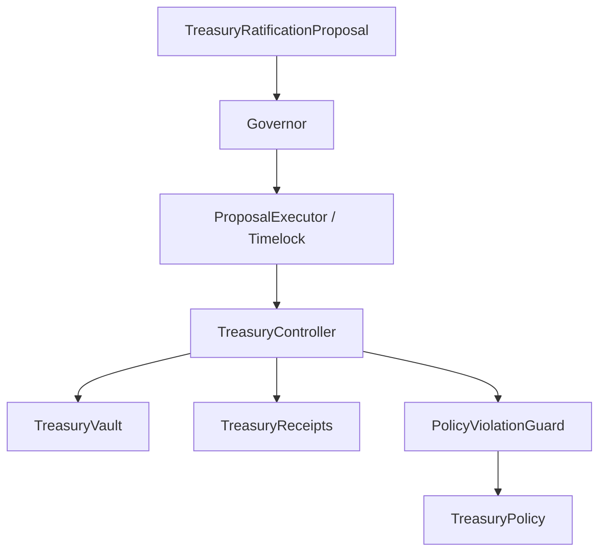
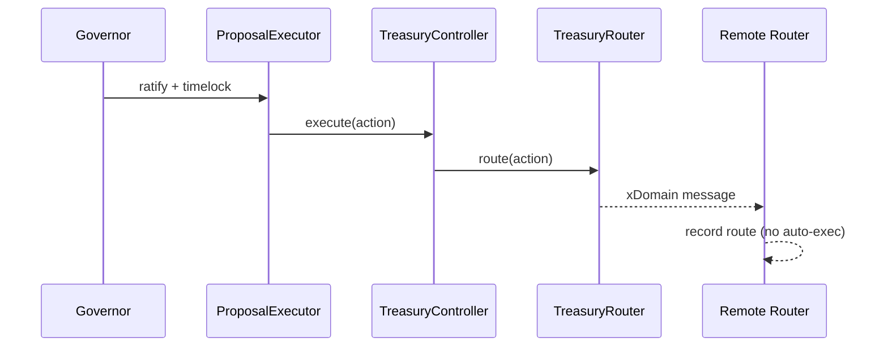
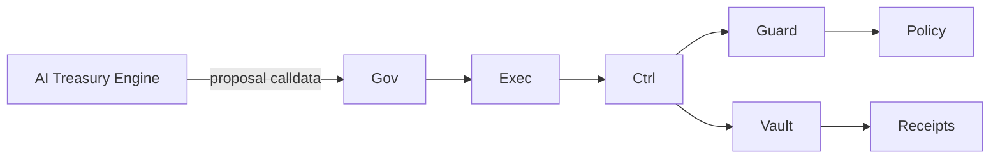
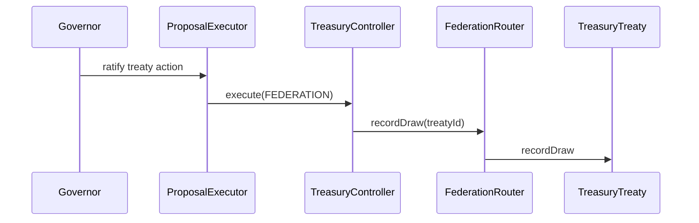

# GhostChain Treasury Constitution

## 1. Constitutional Constraints

- All treasury mutations must be proposal-ratified, timelocked, and executed via `TreasuryController`.
- Emergency powers are freeze-only. No emergency withdrawals.
- Policy ambiguity fails closed: no execution without explicit policy compliance.
- No EOAs hold unilateral treasury authority.

## 2. Canonical Execution Path

```
TreasuryRatificationProposal -> Governor -> ProposalExecutor -> TreasuryController -> TreasuryVault
```

## 3. Control Flow (Mermaid)



## 4. Cross-Chain Constraints (Mermaid)



## 5. Rebalancing Loop (Mermaid)



## 6. Federation Treaty Flow (Mermaid)



## 7. Rollback / Freeze Procedures

- If any invariant fails or policy mismatch occurs, set `PolicyViolationGuard.emergencyFreeze = true`.
- Freeze does not permit withdrawals; it only blocks further actions.
- To resume, governance must ratify a policy-corrective proposal.

