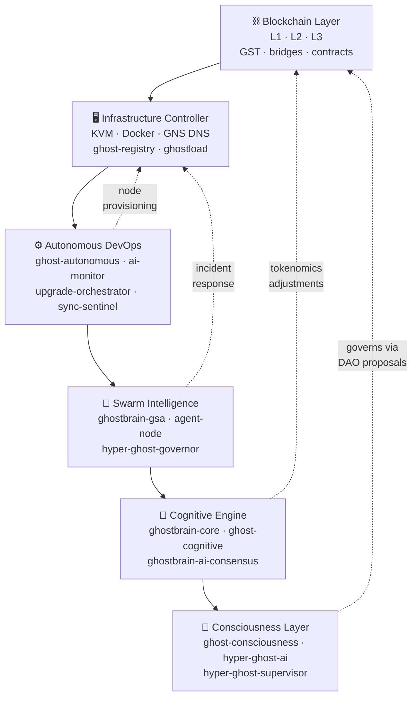
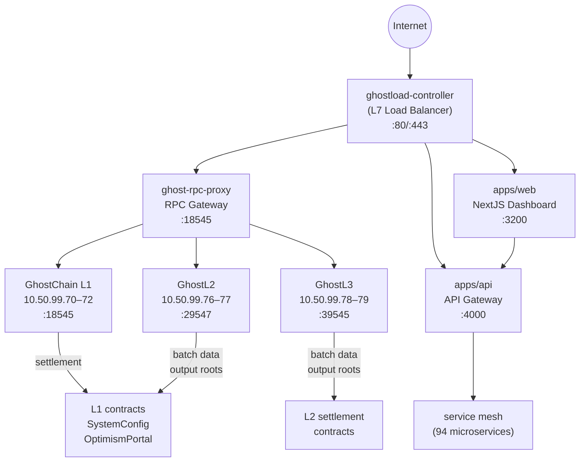
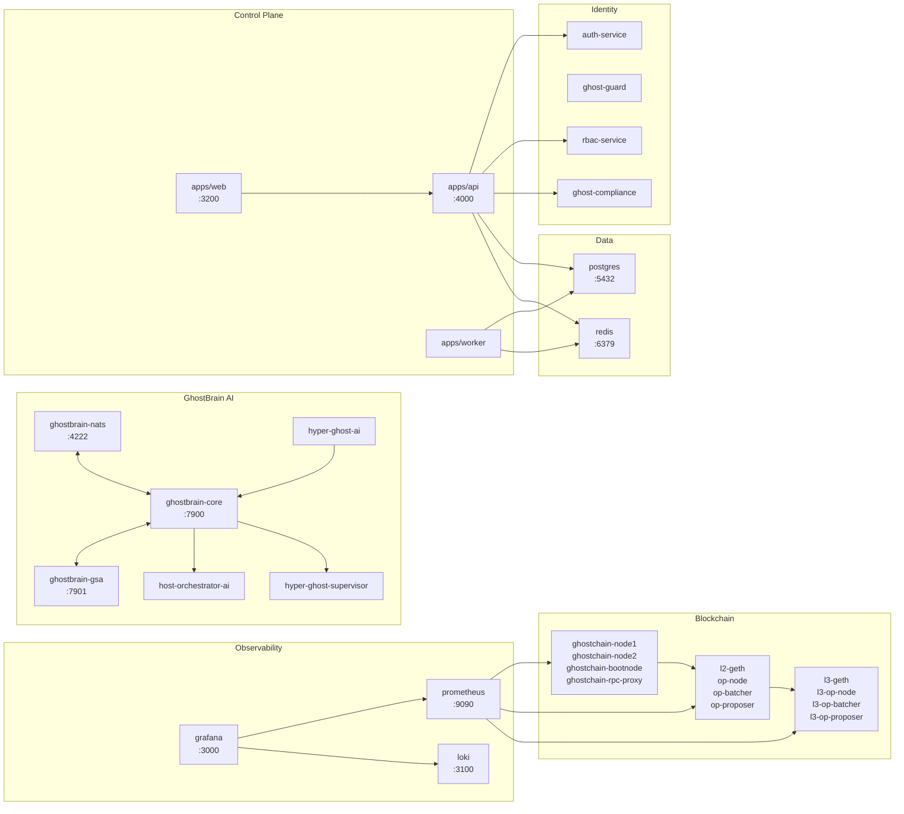
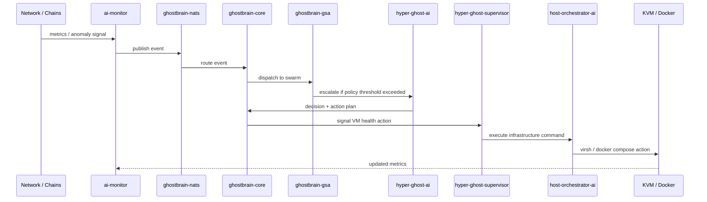
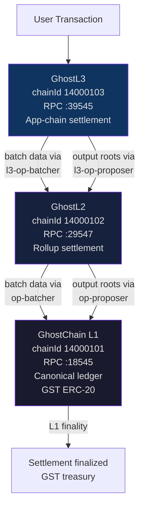
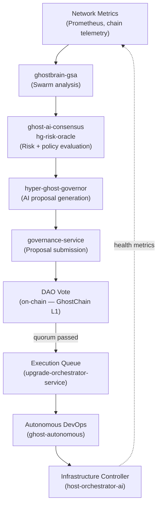
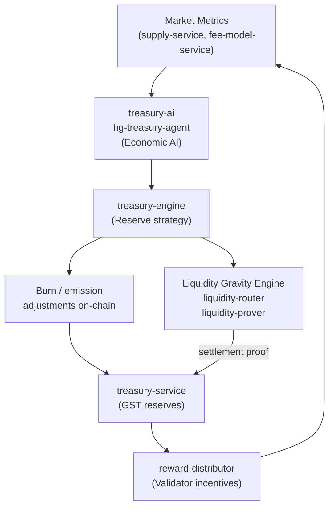
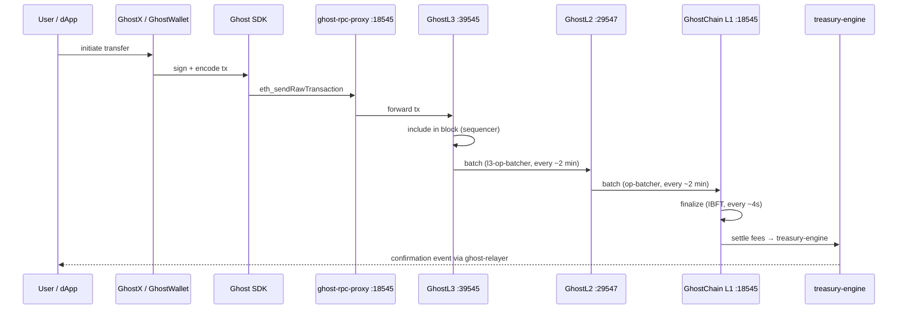
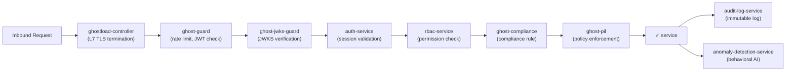
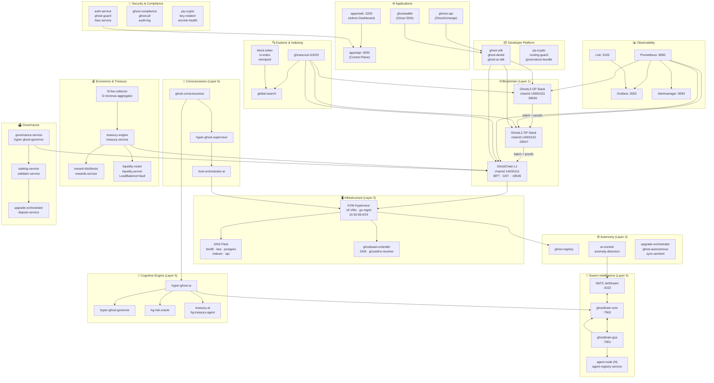

# GhostStack Master Architecture Blueprint

> **The complete technical north star for building and operating GhostStack.**
> Ground-truth data sourced from live repository files: `inventory.sh`, `service-catalog.md`,
> `ghostchain-architecture.md`, `stack.env.example`, `capabilities.md`, and all compose files.

---

## Table of Contents

1. [System Layers Overview](#1-system-layers-overview)
2. [GhostStack Core Services](#2-ghoststack-core-services)
3. [Network Topology](#3-network-topology)
4. [VM Infrastructure Layout](#4-vm-infrastructure-layout)
5. [Container Architecture](#5-container-architecture)
6. [AI Orchestration Flows](#6-ai-orchestration-flows)
7. [Cross-Chain Routing](#7-cross-chain-routing)
8. [Governance Loops](#8-governance-loops)
9. [Economic Control Loop](#9-economic-control-loop)
10. [Data Flow](#10-data-flow)
11. [Security Architecture](#11-security-architecture)
12. [SDK & Developer Platform](#12-sdk--developer-platform)
13. [Full Ecosystem Map](#13-full-ecosystem-map)
14. [Operational Reference](#14-operational-reference)

---

## 1. System Layers Overview

GhostStack is organized into six ascending layers. Each layer depends on the layer beneath it.
AI layers sit above infra but act downward as autonomous operators.

```
┌──────────────────────────────────────────────────────────────────────────┐
│  LAYER 6 — Consciousness Layer                                           │
│  ghost-consciousness · hyper-ghost-ai · hyper-ghost-supervisor           │
│  Global coordination · cross-chain diplomacy · long-horizon strategy     │
└──────────────────────────────────────────────────────────────────────────┘
┌──────────────────────────────────────────────────────────────────────────┐
│  LAYER 5 — Cognitive Engine                                              │
│  ghost-cognitive · ghost-swarm · ghostbrain-core · ghostbrain-gsa        │
│  ghost-ai-consensus · ghost-ai-attestor · ghost-ai-contract-engine       │
│  Adaptive tokenomics · threat analysis · memory · planning               │
└──────────────────────────────────────────────────────────────────────────┘
┌──────────────────────────────────────────────────────────────────────────┐
│  LAYER 4 — Swarm Intelligence                                            │
│  ghost-swarm · agent-node · agent-registry-service                       │
│  host-orchestrator-ai · ghostbrain-gsa · hyper-ghost-governor            │
│  Distributed AI agents · consensus anomaly detection · DAO loops         │
└──────────────────────────────────────────────────────────────────────────┘
┌──────────────────────────────────────────────────────────────────────────┐
│  LAYER 3 — Autonomous DevOps                                             │
│  ghost-autonomous · ai-monitor · anomaly-detection-service               │
│  upgrade-orchestrator-service · self-healing.sh · ghost-sync-sentinel    │
│  CI/CD · auto-scaling · health gating · self-repair                      │
└──────────────────────────────────────────────────────────────────────────┘
┌──────────────────────────────────────────────────────────────────────────┐
│  LAYER 2 — Infrastructure Controller                                     │
│  ghost-infra · ghostdns-resolver · ghostload-controller                  │
│  ghost-registry · network-context-service · ghostvm-ai                   │
│  KVM hypervisor · Docker · DNS (GNS) · load balancing                    │
└──────────────────────────────────────────────────────────────────────────┘
┌──────────────────────────────────────────────────────────────────────────┐
│  LAYER 1 — Blockchain Layer                                              │
│  GhostChain L1 (chainId 14000101) · GhostL2 (14000102)                   │
│  GhostL3 (14000103) · op-batcher · op-proposer · ghost-relayer           │
│  GST ERC-20 · settlement · fraud proofs · bridge hub                     │
└──────────────────────────────────────────────────────────────────────────┘
```

### Layer Dependency Diagram



---

## 2. GhostStack Core Services

### 2.1 Blockchain Components

| Service | Role | Chain | Port |
|---------|------|-------|------|
| `ghostchain-bootnode` | P2P discovery seed | L1 (14000101) | 30303 (UDP) |
| `ghostchain-node1` / `node2` | IBFT validator nodes | L1 | 18545 (RPC) |
| `ghostchain-rpc-proxy` (`ghost-rpc-proxy`) | Public RPC gateway | L1 | 18545 |
| `l2-geth` (op-geth) | L2 execution engine | L2 (14000102) | 29546 |
| `op-node` | L2 sequencer / derivation | L2 | 29547 (authrpc) |
| `op-batcher` | Batch poster → L1 | L2 | 8548 |
| `op-proposer` | Output root poster → L1 | L2 | 8560 |
| `l3-geth` | L3 execution engine | L3 (14000103) | 39545 |
| `l3-op-node` | L3 sequencer / derivation | L3 | 39546 |
| `l3-op-batcher` | Batch poster → L2 | L3 | 9548 |
| `l3-op-proposer` | Output root poster → L2 | L3 | 9560 |
| `ghost-relayer` | L1↔L2 message relay | Bridge | 8080 |
| `ghostchain-bridge-hub` | Cross-chain bridge hub | All | 8090 |
| `ghost-rollup-challenger` | Fraud proof challenger | L2/L3 | internal |
| `ghost-rollup-proposer` | Output poster (alt) | L2/L3 | internal |
| `rpc-forward-l1-29545` | L1 RPC port forwarder | L1 | 29545 |

**GST Token (canonical gas asset)**
- L1 contract: `0x5FbDB2315678afecb367f032d93F642f64180aa3`
- Symbol: `GST` · Decimals: `18`
- Genesis mint: `1,000,000,000 GST` → `0xf39fd6...2266`

---

### 2.2 AI & Intelligence Services

#### GhostBrain Core Stack (`docker-compose.ghostbrain.yml`)

| Service | Port | Role |
|---------|------|------|
| `ghostbrain-core` | 7900 | Brain loop · incident management · plan execution |
| `ghostbrain-gsa` | 7901 | Swarm agent coordinator |
| `ghostbrain-nats` | 4222 | NATS JetStream message bus |
| `ghostbrain-postgres` | 5432 (internal) | Brain state persistence |
| `ghostbrain-redis` | 6379 (internal) | Brain cache / pub-sub |
| `host-orchestrator-ai` | 7902 | libvirt + Docker execution agent |
| `hyper-ghost-supervisor` | 7903 | VM health → GhostBrain signals |

#### Autonomy Stack (`docker-compose.autonomy.yml`)

| Service | Port | Role |
|---------|------|------|
| `ghost-registry` | 8088 (host: 28088) | RPC endpoint registry |
| `network-context-service` | 7633 (host: 17633) | Network topology context |
| `anomaly-detection-service` | — | On-chain anomaly detection |
| `ai-monitor` | — | AI health + performance monitor |
| `ai-clock-sync` | — | Distributed AI clock synchronization |
| `ai-policy` | — | Policy evaluation engine |
| `ai-vault` | — | AI secret management |
| `ghost-sync-sentinel` | — | State sync watchdog |
| `upgrade-orchestrator-service` | — | Coordinated node upgrades |

#### Hyper Ghost AI Layer

| Service | Role |
|---------|------|
| `hyper-ghost-ai` | Top-level AI decision hub |
| `hyper-ghost-governor` | AI-assisted governance proposals |
| `hg-risk-oracle` | Risk assessment oracle |
| `hg-treasury-agent` | Autonomous treasury operations |
| `hg-proof-snapshotter` | ZK proof snapshot generation |
| `hg-reporting-indexer` | Governance reporting indexer |

#### Specialized AI Services

| Service | Role |
|---------|------|
| `ghost-ai-attestor` | Cross-chain attestation agent |
| `ghost-ai-consensus` | Consensus-level AI validation |
| `ghost-ai-contract-engine` | Smart contract AI analyzer |
| `ghostcontract-ai` | Contract risk AI |
| `ghostdns-ai` | DNS anomaly + routing AI |
| `ghostdns-ai-policy` | DNS policy enforcement AI |
| `ghostload-ai` | Load balancing AI |
| `ghostvm-ai` | VM resource optimization AI |
| `ghost-storage-ai` | Storage tier optimization |
| `vm-protocol-ai` | Hypervisor protocol AI |
| `explainability-service` | AI decision explainability |
| `forecasting-service` | On-chain metrics forecasting |
| `autonomous-vault-hypervisor` | Autonomous vault management |

---

### 2.3 Control Plane (Web + API)

| Component | Stack | Port | Role |
|-----------|-------|------|------|
| `apps/api` | Express 5 + TypeScript | 4000 | REST API · auth · all service proxies |
| `apps/web` | Next.js 14 | 3200 | Admin UI · dashboards |
| `apps/worker` | Node.js | — | Background job processor |

**API modules (from `capabilities.md`):**
Identity & access · Security & compliance · Chain & consensus · Nodes/ops · Validators/staking ·
Explorer · Tokenomics & treasury · Contracts · Bridges & interop · AI/fraud/forecasting ·
Observability & alerts · DevOps & upgrades · Governance · Integrations

---

### 2.4 Data & Persistence

| Service | Engine | Port | Data |
|---------|--------|------|------|
| `postgres` (main) | PostgreSQL 16 | 5432 | Compliance, auth, session state |
| `redis` (main) | Redis 7 | 6379 | Cache, session, rate limit |
| `ghostbrain-postgres` | PostgreSQL 16 | internal | Brain loop state |
| `ghostbrain-redis` | Redis 7 | internal | Brain pub-sub |
| `gns-postgres` | PostgreSQL 16 | 5432@10.50.99.32 | GNS zone records |
| `ghostscout-db` | PostgreSQL | internal | Explorer state |
| `gas-engine-postgres` | PostgreSQL | internal | Gas market data |
| `pil-postgres` | PostgreSQL | internal | PIL data |

---

### 2.5 Identity & Security

| Service | Port | Role |
|---------|------|------|
| `auth-service` | 7700 | JWT/session authentication |
| `ghost-guard` | 7701 | Request guard / rate limiter |
| `ghost-jwks-guard` | 7702 | JWKS key verification |
| `rbac-service` | 7703 | Role-based access control |
| `session-service` | 7704 | Session management |
| `ghost-compliance` | 7800 | Compliance rule engine |
| `ghost-compliance-worker` | — | Async compliance jobs |
| `compliance-export-service` | — | Compliance report exporter |
| `audit-log-service` | 7705 | Immutable audit trail |
| `secrets-health-service` | — | Vault secret health monitor |
| `key-rotation-service` | — | Automated key rotation |
| `ghost-pil` | — | Policy-in-language engine |
| `ghost-pil-worker` | — | PIL async processor |

---

### 2.6 Observability

| Service | Port | Role |
|---------|------|------|
| Prometheus | 9090 | Metrics collection & alerting |
| Grafana | 3000 | Dashboards & visualization |
| Loki | 3100 | Log aggregation |
| Alertmanager | 9093 | Alert routing |
| `alerts-service` | 7600 | Custom alert processor |
| `notifications-service` | 7601 | Multi-channel notification router |
| `consensus-telemetry-service` | 7602 | IBFT + OP Stack consensus telemetry |
| `chain-status-service` | 7603 | Live chain head + finality lag |

---

### 2.7 Treasury & Economics

| Service | Port | Role |
|---------|------|------|
| `treasury-service` | 7500 | Core treasury operations |
| `treasury-engine` | 7501 | Autonomous reserve management |
| `treasury-ai` | 7502 | AI treasury strategy |
| `treasury-evidence` | 7503 | ZK solvency proof store |
| `l3-fee-collector` | — | L3 → L2 fee routing |
| `l2-revenue-aggregator` | — | L2 revenue → treasury |
| `reward-distributor` | — | Validator + staker rewards |
| `payout-service` | — | Scheduled payout execution |
| `supply-service` | — | GST supply tracking |
| `fee-model-service` | — | Gas fee model calculator |
| `liquidity-service` | — | Protocol-owned liquidity |
| `liquidity-router` | — | LGE strategy + execution |
| `liquidity-prover` | — | ZK liquidity proof generation |
| `hg-risk-oracle` | — | Risk scoring for treasury ops |

---

### 2.8 Governance

| Service | Port | Role |
|---------|------|------|
| `governance-service` | 7400 | On-chain proposal management |
| `hyper-ghost-governor` | 7401 | AI-assisted governance actor |
| `staking-service` | 7402 | Validator staking + delegation |
| `validator-service` | 7403 | Validator registry |
| `rewards-service` | 7404 | Reward computation |
| `participation-service` | 7405 | Voting participation tracking |
| `slashing-detection-service` | — | Slashing condition monitor |
| `dispute-service` | — | Fraud proof dispute resolution |

---

### 2.9 Explorer & Indexing

| Service | Port | Role |
|---------|------|------|
| `ghostscout-l1` | 4000 | L1 block explorer backend |
| `ghostscout-l2` | 4001 | L2 block explorer backend |
| `ghostscout-l3` | 4002 | L3 block explorer backend |
| `ghostscout-frontend-l1` | 3001 | L1 explorer UI |
| `ghostscout-frontend-l2` | 3002 | L2 explorer UI |
| `ghostscout-frontend-l3` | 3003 | L3 explorer UI |
| `block-index-service` | 7300 | Block indexer |
| `tx-index-service` | 7301 | Transaction indexer |
| `mempool-service` | 7302 | Mempool monitor |
| `global-search-service` | 7303 | Cross-chain search |
| `entity-tagging-service` | — | Address/entity labeling |
| `gns-indexer` | — | GNS zone indexer |
| `ghostdns-indexer` | — | DNS record indexer |
| `hg-reporting-indexer` | — | Governance reporting |

---

### 2.10 GhostX, GNS, Gas Engine

| Service | Port | Role |
|---------|------|------|
| `ghostx-api` | 8100 | GhostXchange trading API |
| `gns-api` | 8200 | Ghost Name Service API |
| `gns-bind9` | 53 | DNS authoritative server |
| `gns-kea` | 8443 | DHCP + DDNS controller |
| `ghostdns-resolver` | 5353 | Recursive DNS resolver |
| `ghostload-controller` | 8300 | L7 load balancer controller |
| `ghost-gas-engine` | 8400 | Gas market engine |
| `ghost-gas-engine-worker` | — | Gas engine async jobs |
| `ghost-mapper` | 18545/29547/39545 | RPC port mapper (dev) |

---

## 3. Network Topology

### 3.1 External → Internal Flow



### 3.2 KVM Management Network

```
Network:  gs-mgmt
CIDR:     10.50.99.0/24
Gateway:  10.50.99.1
Bridge:   virbr-ghoststack

┌── Infra / Frontend ───────────┐
│  ghost-web        10.50.99.10 │
│  ghost-dns-slave  10.50.99.66 │
└───────────────────────────────┘
┌── GhostChain L1 cluster ──────┐
│  bootnode         10.50.99.20 │
│  node1            10.50.99.21 │
│  node2            10.50.99.22 │
└───────────────────────────────┘
┌── GNS Fleet ──────────────────┐
│  gns-bind9        10.50.99.30 │
│  gns-kea          10.50.99.31 │
│  gns-postgres     10.50.99.32 │
│  gns-indexer      10.50.99.33 │
│  gns-api          10.50.99.34 │
└───────────────────────────────┘
┌── Devnet / Testnet ───────────┐
│  ghostchain-devnet  38.247.149.219 │
│  testnet-l1       10.50.99.71 │
│  testnet-validator 10.50.99.73│
│  ghostl2-testnet  10.50.99.77 │
│  ghostl3-testnet  10.50.99.79 │
└───────────────────────────────┘
┌── Mainnet ─────────────────────┐
│  mainnet-l1       10.50.99.70 │
│  mainnet-validator 10.50.99.72│
│  ghostl2-mainnet  10.50.99.76 │
│  ghostl3-mainnet  10.50.99.78 │
└───────────────────────────────┘
```

---

## 4. VM Infrastructure Layout

### 4.1 Complete VM Fleet

| VM Name | IP | vCPU | RAM | Disk | Role |
|---------|-----|------|-----|------|------|
| `ghost-web` | 10.50.99.10 | 4 | 8 GB | 100 GB | Web frontend + API host |
| `ghost-dns-slave` | 10.50.99.66 | 2 | 2 GB | 20 GB | Secondary DNS (BIND9 replica) |
| `ghost-ghostchain-bootnode-1` | 10.50.99.20 | 2 | 4 GB | 50 GB | L1 P2P discovery bootnode |
| `ghost-ghostchain-node1-1` | 10.50.99.21 | 4 | 8 GB | 200 GB | L1 IBFT validator node 1 |
| `ghost-ghostchain-node2-1` | 10.50.99.22 | 4 | 8 GB | 200 GB | L1 IBFT validator node 2 |
| `gns-bind9` | 10.50.99.30 | 2 | 2 GB | 20 GB | GNS authoritative DNS |
| `gns-kea` | 10.50.99.31 | 2 | 2 GB | 20 GB | DHCP + DDNS controller |
| `gns-postgres` | 10.50.99.32 | 2 | 4 GB | 50 GB | GNS zone database |
| `gns-indexer` | 10.50.99.33 | 2 | 4 GB | 50 GB | GNS zone indexer |
| `gns-api` | 10.50.99.34 | 2 | 4 GB | 20 GB | GNS REST API |
| `ghostchain-devnet` | 38.247.149.219 | 4 | 8 GB | 100 GB | All-in-one devnet controller |
| `ghostchain-testnet-l1` | 10.50.99.71 | 4 | 8 GB | 200 GB | Testnet L1 GhostChain |
| `ghost-testnet-validator` | 10.50.99.73 | 4 | 8 GB | 100 GB | Testnet L1 validator |
| `ghostl2-testnet` | 10.50.99.77 | 4 | 8 GB | 200 GB | Testnet OP Stack L2 |
| `ghostl3-testnet` | 10.50.99.79 | 4 | 8 GB | 200 GB | Testnet OP Stack L3 |
| `ghostchain-mainnet-l1` | 10.50.99.70 | 8 | 32 GB | 1 TB | Mainnet L1 GhostChain |
| `ghost-mainnet-validator` | 10.50.99.72 | 8 | 16 GB | 500 GB | Mainnet L1 validator |
| `ghostl2-mainnet` | 10.50.99.76 | 8 | 32 GB | 1 TB | Mainnet OP Stack L2 |
| `ghostl3-mainnet` | 10.50.99.78 | 8 | 16 GB | 500 GB | Mainnet OP Stack L3 |

**Total fleet: 19 KVM VMs** — ordered boot sequence defined in `inventory.sh:ALL_VMS[]`.

### 4.2 VM Boot Order (from `ALL_VMS` array)

```
Boot order:
  1. ghost-web              (frontend host)
  2. ghost-dns-slave        (DNS replica)
  3. ghost-ghostchain-bootnode-1  (L1 P2P seed)
  4. ghost-ghostchain-node1-1     (L1 validator 1)
  5. ghost-ghostchain-node2-1     (L1 validator 2)
  6. gns-bind9              (authoritative DNS)
  7. gns-kea                (DHCP/DDNS)
  8. gns-postgres            (GNS DB)
  9. gns-indexer             (GNS indexer)
 10. gns-api                 (GNS API)
 11. ghostchain-devnet        (devnet — all-in-one)
 12. ghostchain-testnet-l1   
 13. ghost-testnet-validator 
 14. ghostl2-testnet         
 15. ghostl3-testnet         
 16. ghostchain-mainnet-l1   
 17. ghost-mainnet-validator 
 18. ghostl2-mainnet         
 19. ghostl3-mainnet         
```

---

## 5. Container Architecture

### 5.1 Docker Compose Stack Map

| Compose File | Services | Purpose |
|--------------|----------|---------|
| `docker-compose.yml` | postgres, redis, migrate, ghost-compliance | Compliance stack + data layer |
| `docker-compose.dev.yml` | all services (dev overrides) | Local development |
| `docker-compose.autonomy.yml` | ghost-registry, network-context, anomaly, ai-monitor, … | Autonomy + AI infrastructure |
| `docker-compose.ghostbrain.yml` | nats, ghostbrain-core, ghostbrain-gsa, host-orchestrator-ai | GhostBrain AI hub |
| `docker-compose.phase3.yml` | ghost-guard, ghost-compliance, ghost-pil, governance-service | Phase 3 compliance + governance |
| `docker-compose.agents.yml` | agent-node, agent-registry-service | Swarm agent network |
| `docker-compose.ai-consensus.yml` | ghost-ai-consensus, ghost-ai-attestor | AI consensus layer |
| `docker-compose.cascading-finality.yml` | finality cascade services | Finality assurance |
| `docker-compose.ghostx.yml` | ghostx-api, gns-api, ghost-gas-engine | GhostX + GNS + gas |
| `docker-compose.ghostbrain.yml` | ghostbrain-* | Brain loop stack |
| `docker-compose.sovereign.yml` | compliance stack (production mode) | Sovereign hardened stack |
| `docker-compose.econ.mainnet.yml` | treasury-engine, l2-revenue-aggregator, reward-distributor | Mainnet economics |
| `docker-compose.econ.testnet.yml` | (same, testnet params) | Testnet economics |
| `docker-compose.econ.devnet.yml` | (same, devnet params) | Devnet economics |
| `infra/ghostchain/docker-compose.l1.yml` | ghostchain-node1/2/bootnode | L1 node cluster |
| `infra/ghostchain/docker-compose.ibft.yml` | IBFT consensus nodes | IBFT validator cluster |
| `infra/opstack/docker-compose.yml` | op-node, l2-geth, op-batcher, op-proposer | L2 OP Stack |
| `infra/opstack/docker-compose.l3.yml` | l3-op-node, l3-geth, l3-op-batcher | L3 OP Stack |
| `infra/opstack/docker-compose.challengers.yml` | ghost-rollup-challenger | L2/L3 fraud proofs |
| `apps/docker-compose.yml` | apps/api, apps/web, apps/worker | Control plane |

### 5.2 Service Container Topology



---

## 6. AI Orchestration Flows

### 6.1 Brain Loop (Normal Operation)



### 6.2 Incident Response Flow

```
Anomaly detected (anomaly-detection-service)
        │
        ▼
Ghost-sync-sentinel validates state drift
        │
        ▼
ghostbrain-nats publishes INCIDENT event
        │
        ▼
ghostbrain-core classifies severity (P0–P3)
        │
        ├──(P0/P1)──► hyper-ghost-ai evaluates strategy
        │                    │
        │              hyper-ghost-supervisor
        │                    │
        │              host-orchestrator-ai → VM/container action
        │
        └──(P2/P3)──► ghost-autonomous self-heals
                            │
                      upgrade-orchestrator-service
                            │
                      ghost-sync-sentinel confirms
```

### 6.3 AI Decision Hierarchy

```
👻 ghost-consciousness    (global strategy, long-horizon)
        │
🧠 hyper-ghost-ai         (tactical decision hub)
        │
⚡ ghostbrain-core        (plan generation + tracking)
        │
🔬 ghostbrain-gsa         (swarm agent dispatch)
        │
🤖 agent-node (N)         (leaf executor agents)
        │
🖥 host-orchestrator-ai   (infra execution)
        │
🌐 KVM + Docker           (physical resources)
```

### 6.4 AI Services Enabled Per Phase

| Phase | AI Services Active |
|-------|--------------------|
| Phase 1 (bootstrap) | `ghost-registry`, `ai-clock-sync`, `ai-monitor` |
| Phase 2 (swarm) | + `ghostbrain-core`, `ghostbrain-gsa`, `ghostbrain-nats` |
| Phase 3 (governance) | + `hyper-ghost-governor`, `ghost-ai-consensus`, `ghost-ai-attestor` |
| Phase 4 (full autonomy) | + `hyper-ghost-ai`, `ghost-consciousness`, `autonomous-vault-hypervisor` |
| Phase 5 (production) | + all 30+ AI specialist services |

---

## 7. Cross-Chain Routing

### 7.1 Canonical Chain Hierarchy



**Routing law (enforced in `docker-compose.ghostbrain.yml`):**
> `L3 → L2 → L1` — Direct `L3 → L1` routing is **FORBIDDEN**.

### 7.2 Bridge & Relay Services

| Bridge Component | Direction | Protocol |
|-----------------|-----------|---------|
| `ghost-relayer` | L1 ↔ L2 | OP Standard Bridge |
| `ghostchain-bridge-hub` | L1 ↔ L2 ↔ L3 | Custom multi-hop |
| `ghost-rollup-proposer` | L2 → L1 | Output oracle |
| `ghost-rollup-challenger` | L2/L3 fraud | Dispute game |
| `l3-op-proposer` | L3 → L2 | L3 output oracle |
| `ghost-mapper` | Dev RPC | Port proxy (host) |
| `rpc-forward-l1-29545` | L1 RPC | Port forward |

### 7.3 Message Routing Rules

```
Routing guard: packages/routing-guard
Routing law:   packages/routing-law
Policy:        packages/ghostload-policy, packages/ghostdns-policy

L3 → L2 → L1   ✓  (canonical)
L2 → L1        ✓  (canonical)
L3 → L1        ✗  (BLOCKED by routing-guard)
L1 → L2        ✓  (deposits via OptimismPortal)
L1 → L3        ✗  (must route through L2)
```

### 7.4 RPC Endpoint Map

| Layer | JSON-RPC | AuthRPC (Engine) | WS | P2P |
|-------|---------|------------------|----|-----|
| L1 | :18545 | :18551 | :18546 | :30303 |
| L2 | :29545 | :29547 | :29546 | :30304 |
| L3 | :39545 | :39547 | :39546 | :30305 |
| L1 (gate) | :28546 | — | — | — |

---

## 8. Governance Loops

### 8.1 On-Chain Governance Flow



### 8.2 Governance Service Roles

| Service | Role |
|---------|------|
| `governance-service` | Proposal create/track/execute |
| `hyper-ghost-governor` | AI proposes based on metrics |
| `ghost-ai-consensus` | AI validates proposal safety |
| `hg-risk-oracle` | Risk-scores proposal impact |
| `staking-service` | Voting power management |
| `participation-service` | Quorum tracking |
| `validator-service` | Validator eligibility |
| `slashing-detection-service` | Penalizes bad validators |
| `dispute-service` | Fraud proof arbitration |

### 8.3 Proposal Lifecycle

```
Draft (hyper-ghost-governor AI)
    │  risk-score < threshold → rejected
    │  risk-score OK
    ▼
Submitted (governance-service on-chain)
    │  7-day voting window
    ▼
Vote (staking-service tallies power)
    │  quorum: 51% participation, 66% approval
    ▼
Queued (timelock: 48h for standard, 12h for emergency)
    │
    ▼
Executed (upgrade-orchestrator-service + ghost-autonomous)
    │
    ▼
Evidence (hg-reporting-indexer + treasury-evidence)
```

---

## 9. Economic Control Loop

### 9.1 Tokenomics Feedback Cycle



### 9.2 GST Token Flow

```
Users pay L3 gas (GST)
        │
l3-fee-collector aggregates
        │
l2-revenue-aggregator sweeps to L2
        │
ghost-relayer bridges to L1
        │
treasury-engine allocates:
    ├── 33% → validator rewards (reward-distributor)
    ├── 33% → protocol-owned liquidity (LoadBalancerVault)
    └── 33% → burn (RewardRouter.buyback)
        │
supply-service tracks total supply
        │
hg-risk-oracle monitors economic health
```

### 9.3 Liquidity Gravity Engine (LGE)

**On-chain contracts** (`contracts/src/liquidity/`):
- `LoadBalancerVault` — deposit/deploy capital with per-adapter caps
- `AdapterRegistry` — governance-approved deployment venues
- `SettlementOracle` — verifies yield/settlement proofs (ECDSA or ZK)
- `RewardRouter` — reinjection splits (POL / buyback / validators)
- `CircuitBreaker` — global + per-adapter pause controls
- `OperatorBondVault` — operator slashing bonds

**Off-chain services** (`services/liquidity-router/`):
- Strategy Engine — proposals (never bypasses on-chain policy)
- Risk Engine — computes allowed action envelope
- Execution Manager — submits deploy/unwind to `LoadBalancerVault`
- Settlement Manager — generates proofs, calls `SettlementOracle`

---

## 10. Data Flow

### 10.1 User Transaction Path



### 10.2 Control Plane Data Flow

```
Browser → apps/web (:3200)
    │ Next.js server-side + client fetch
    ▼
apps/api (:4000)  ← httpOnly session cookie + CSRF token
    │
    ├──► ghost-compliance (compliance check)
    ├──► auth-service (JWT validation)
    ├──► rbac-service (permission check)
    │
    ├──► ghostbrain-core (AI insights)
    ├──► governance-service (proposals)
    ├──► treasury-service (balances)
    ├──► ghostscout-l1/l2/l3 (explorer data)
    ├──► Prometheus / Grafana / Loki (observability)
    │
    └──► chain-status-service / consensus-telemetry-service
              │
              └──► ghostchain-rpc-proxy:18545 / op-node:29547
```

---

## 11. Security Architecture

### 11.1 Security Layers

```
┌─────────────────────────────────────────────────────────────┐
│  LAYER 7: AI Threat Intelligence                            │
│  anomaly-detection-service · ghost-ai-attestor              │
│  ghost-ai-consensus · hg-risk-oracle                        │
└─────────────────────────────────────────────────────────────┘
┌─────────────────────────────────────────────────────────────┐
│  LAYER 6: Application Security                              │
│  ghost-guard · ghost-jwks-guard · rbac-service              │
│  ghost-compliance · ghost-pil                               │
└─────────────────────────────────────────────────────────────┘
┌─────────────────────────────────────────────────────────────┐
│  LAYER 5: Identity & Access Management                      │
│  auth-service · session-service · key-rotation-service      │
│  secrets-health-service · audit-log-service                 │
└─────────────────────────────────────────────────────────────┘
┌─────────────────────────────────────────────────────────────┐
│  LAYER 4: Container Hardening                               │
│  user: 10001:10001 (non-root) · cap_drop: ALL               │
│  no-new-privileges · read_only rootfs · tmpfs /tmp          │
└─────────────────────────────────────────────────────────────┘
┌─────────────────────────────────────────────────────────────┐
│  LAYER 3: Network Segmentation                              │
│  UFW firewall · KVM gs-mgmt isolated network                │
│  localhost-bound ports · ghostload-controller L7 proxy      │
└─────────────────────────────────────────────────────────────┘
┌─────────────────────────────────────────────────────────────┐
│  LAYER 2: Cryptographic Foundations                         │
│  pq-crypto package (post-quantum) · packages/pq-crypto      │
│  OP Stack dispute games · ZK solvency proofs (zk-solvency)  │
└─────────────────────────────────────────────────────────────┘
┌─────────────────────────────────────────────────────────────┐
│  LAYER 1: Validator Isolation                               │
│  IBFT validator keys in KVM VMs (not on host)               │
│  Separate mainnet/testnet validator VMs                      │
│  slashing-detection-service · dispute-service               │
└─────────────────────────────────────────────────────────────┘
```

### 11.2 Security Service Map



### 11.3 Key Management

| Key Type | Storage | Rotation |
|----------|---------|---------|
| L1 validator private keys | KVM VM local (not exposed to hypervisor) | `key-rotation-service` |
| OP Stack batcher/proposer keys | `infra/opstack/.env` (secrets injection) | Manual + rotation service |
| JWT signing keys | `secrets-health-service` managed | Automated 30-day |
| API keys | `rbac-service` (hashed) | On-demand revocation |
| DB passwords | Docker secrets / env | `ghost-autonomous` auto-rotation |

---

## 12. SDK & Developer Platform

### 12.1 Package Overview (`packages/`)

| Package | Description |
|---------|-------------|
| `ghost-sdk` | Primary developer SDK (chain interactions, wallet, tokens) |
| `ghost-sdk-core` | Core SDK primitives (signing, RPC, ABI) |
| `ghost-ai-sdk` | AI service integration SDK |
| `ghostchain-sdk` | GhostChain-specific low-level SDK |
| `ghost-devkit` | Development tooling + test helpers |
| `ghost-infra` | Infrastructure management SDK |
| `ghost-swarm` | Swarm intelligence client library |
| `ghost-cognitive` | Cognitive AI client |
| `ghost-consciousness` | Consciousness layer client |
| `ghost-autonomous` | Autonomous operations SDK |
| `dtn-cli` | DTN relay CLI tool |
| `pq-crypto` | Post-quantum cryptography primitives |
| `routing-guard` | Routing rule enforcement |
| `routing-law` | Routing policy definitions |
| `ghostdns-policy` | DNS policy types |
| `ghostdns-types` | GNS type definitions |
| `ghostload-policy` | Load balancer policy definitions |
| `governance-bundle` | Governance contract interfaces |
| `contract-schemas` | On-chain ABI + schema definitions |
| `hardhat-ghost` | Hardhat plugin for GhostChain |
| `ghostwallet` | Wallet primitives library |
| `brand-enforcer` | UI brand compliance checker |
| `types` | Shared TypeScript types |
| `ui` | Shared UI component library |

### 12.2 Developer Flow

```
Ghost SDK → ghostchain-sdk → ghost-rpc-proxy
                                    │
                         ┌──────────┴──────────┐
                         │                     │
                    GhostChain L1           GhostL2/L3
                    (chainId: 14000101)   (chainId: 14000102/03)
```

### 12.3 Ghost CLI Entry Points

```bash
# Deploy contracts to L1
pnpm --filter contracts run deploy:l1

# Bootstrap full stack
sudo bash infrastructure/scripts/genesis-install.sh

# Start in order
bash infrastructure/scripts/service-startup-order.sh

# Run up-full orchestration
bash infra/scripts/up-full.sh

# Health check all layers
bash infra/scripts/doctor.sh
```

---

## 13. Full Ecosystem Map



---

## 14. Operational Reference

### 14.1 Master Port Allocation

| Port | Service | Protocol |
|------|---------|---------|
| 22 | SSH (all VMs) | TCP |
| 53 | gns-bind9 (DNS) | UDP/TCP |
| 3000 | Grafana | HTTP |
| 3100 | Loki | HTTP |
| 3200 | apps/web | HTTP |
| 4000 | apps/api | HTTP |
| 4222 | ghostbrain-nats | TCP |
| 5432 | postgres | TCP |
| 6379 | redis | TCP |
| 7400 | governance-service | HTTP |
| 7500 | treasury-service | HTTP |
| 7600 | alerts-service | HTTP |
| 7700 | auth-service | HTTP |
| 7800 | ghost-compliance | HTTP |
| 7900 | ghostbrain-core | HTTP |
| 7901 | ghostbrain-gsa | HTTP |
| 8088 | ghost-registry (host: 28088) | HTTP |
| 8100 | ghostx-api | HTTP |
| 8200 | gns-api | HTTP |
| 8443 | gns-kea (DHCP ctrl) | HTTPS |
| 9090 | Prometheus | HTTP |
| 9093 | Alertmanager | HTTP |
| 18545 | GhostChain L1 JSON-RPC | HTTP |
| 18546 | GhostChain L1 WS-RPC | WS |
| 18551 | GhostChain L1 AuthRPC | HTTP |
| 28546 | op-gate (L1 gate) | HTTP |
| 29545 | GhostL2 JSON-RPC | HTTP |
| 29546 | GhostL2 WS-RPC | WS |
| 29547 | GhostL2 AuthRPC (Engine API) | HTTP |
| 30303 | GhostChain L1 P2P | TCP/UDP |
| 30304 | GhostL2 P2P | TCP/UDP |
| 30305 | GhostL3 P2P | TCP/UDP |
| 39545 | GhostL3 JSON-RPC | HTTP |
| 39546 | GhostL3 WS-RPC | WS |
| 39547 | GhostL3 AuthRPC | HTTP |

### 14.2 Key Operational Scripts

| Script | Purpose |
|--------|---------|
| `infrastructure/scripts/genesis-install.sh` | Full-stack bootstrap from scratch (20 phases) |
| `infrastructure/scripts/service-startup-order.sh` | 12-stage day-2 service orchestration |
| `infra/scripts/up-full.sh` | Master startup orchestrator (L1→L2→L3→services) |
| `infra/scripts/doctor.sh` | Health check all layers + services |
| `infra/scripts/env-sync-stack.sh` | Sync env vars across all service stacks |
| `infra/hypervisor/provision/create-vms.sh` | Provision all 19 KVM VMs |
| `infra/hypervisor/provision/inventory.sh` | Canonical VM IP / name source of truth |
| `infra/hypervisor/provision/reprovision-all.sh` | Reprovision all VMs in phased order |
| `infra/hypervisor/provision/push-to-vm.sh` | Push artifacts to a specific VM |
| `infra/ghostchain/scripts/up.sh` | Start GhostChain L1 nodes |
| `infra/scripts/opstack/up-l2.sh` | Start OP Stack L2 |
| `infra/scripts/opstack/deploy-l3.sh` | Deploy + start OP Stack L3 |
| `infra/scripts/opstack/keys/init.sh` | Generate OP Stack batcher/proposer/admin keys |
| `scripts/bootstrap-ubuntu.sh` | Host OS bootstrap (apt, Docker CE, Node 22, Foundry) |
| `scripts/start-stack-prod.sh` | Production stack startup |
| `dev-stack.sh` | Developer environment shortcut |

### 14.3 Key Configuration Files

| File | Contents |
|------|---------|
| `infra/hypervisor/provision/inventory.sh` | Canonical VM IPs + ALL_VMS boot order |
| `infra/opstack/.env` | OP Stack chain IDs, keys, batcher config |
| `infra/opstack/config/rollup.json` | L2 rollup config |
| `infra/opstack/l3/ghostl3/config/rollup.json` | L3 rollup config |
| `services/stack.env` | All service URLs, secrets, contract addresses |
| `stack.env.example` | Environment template with real contract addresses |
| `trivy-secret.yaml` | Trivy secret scan exclusions |

### 14.4 Environment Chain IDs

```bash
L1_CHAIN_ID=14000101        # GhostChain L1
L2_CHAIN_ID=14000102        # GhostL2 (OP Stack)
L3_CHAIN_ID=14000103        # GhostL3 (OP Stack)

# GST Token
GST_TOKEN_L1=0x5FbDB2315678afecb367f032d93F642f64180aa3

# RPC Endpoints
RPC_L1=http://127.0.0.1:18545
RPC_L2=http://127.0.0.1:29547
RPC_L3=http://127.0.0.1:39545

# Control Plane
API_URL=http://127.0.0.1:4000
WEB_URL=http://127.0.0.1:3200
```

### 14.5 One-Command Deployments

```bash
# Bootstrap entire GhostStack ecosystem from scratch:
sudo bash infrastructure/scripts/genesis-install.sh

# Day-2: bring all services up in dependency order:
bash infrastructure/scripts/service-startup-order.sh

# Resume from a specific stage (e.g. skip to AI layer):
bash infrastructure/scripts/service-startup-order.sh --stage 4

# Dry-run validation:
GS_DRY_RUN=1 bash infrastructure/scripts/genesis-install.sh

# Tear down all services in reverse order:
bash infrastructure/scripts/service-startup-order.sh --stop

# Full health check across all layers:
bash infra/scripts/doctor.sh
```

---

> **Document Status:** Production ground-truth. All IPs, chain IDs, service names, and port
> numbers are sourced directly from `inventory.sh`, `service-catalog.md`, `capabilities.md`,
> and the live Docker Compose files in this repository.
>
> **Last updated:** 2026-03-06
> **Total services catalogued:** 94 (services/) + 19 VMs + 24 packages
> **Repository:** `https://github.com/ghostchain1/ghostl-stack`
