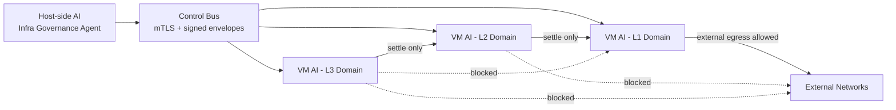
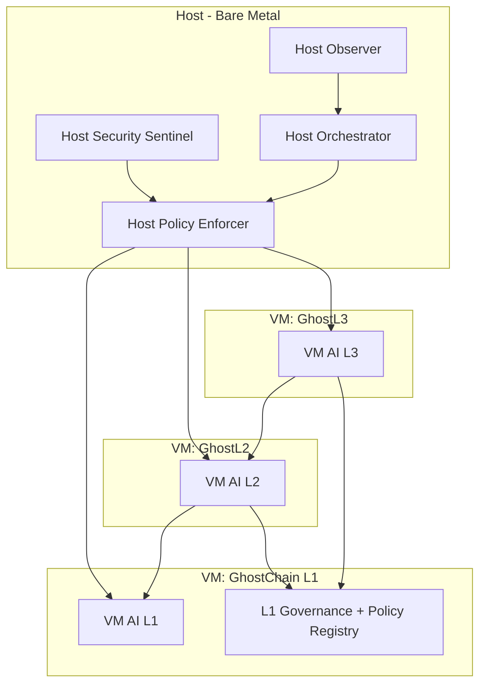

# Host↔VM AI Orchestration Blueprint (GhostStack)

Date: 2026-02-24

Companion artifacts:
- `docs/ai-core/host-vm-ai-implementation-checklist.md`
- `docs/ai-core/host-vm-ai-message-contracts.md`

## 1) Environment Analysis Snapshot

### Bare-metal host (observed)
- Hostname: `ghostchain-devnet`
- Kernel: `Linux 6.8.0-100-generic x86_64`
- CPU capacity: `8` cores
- Memory: `15.6 GB`
- Virtualization toolchain currently installed:
  - `virsh`: missing
  - `qemu-system-x86_64`: missing
  - Docker runtime present and active

### Running GhostStack control runtime (observed)
- Active control services in autonomy profile include:
  - `ghost-mapper`
  - `ghost-registry`
  - `network-context-service`
  - `consensus-telemetry-service`
  - `network-manager-service`
  - GhostDNS AI services (`ghostdns-indexer`, `ghostdns-resolver`, `ghostdns-ai-policy`, `ghostdns-attestor`)

### Governance and routing constraints already present
- `docs/routing-policy.md` enforces:
  - allowed: `L3 -> L2`, `L2 -> L1`
  - blocked: direct `L3 -> L1`
  - external egress via `L1` only
- `packages/routing-guard/index.js` and bridge/relayer services already enforce this law.
- `docs/consensus-boundaries.md` establishes that automation must use client APIs and not alter consensus internals.

## 2) Role Model

### A. Host-side AI (Infrastructure Governance Agent)

Primary mission: infrastructure monitoring, VM lifecycle orchestration, and security oversight.

Modules:
1. **Host Observer**
   - collects host metrics (CPU, memory, thermals/power where available, I/O saturation)
   - tracks VM/container liveness and restart churn
2. **Orchestrator**
   - executes bounded actions: start/stop/restart VM or service, scale non-critical workers
   - coordinates maintenance windows and staged rollouts
3. **Security Sentinel**
   - verifies host baseline (kernel, package drift, exposed ports, unexpected privilege changes)
   - checks integrity of runtime policy bundles and certificates
4. **Policy Enforcer (Host Layer)**
   - hard-denies any control request violating layer law (especially any L3→L1 bypass intent)
   - enforces emergency lock and manual-only mode controls

### B. VM-side AI (Protocol Execution Agent)

Primary mission: transaction-flow management, governance-bound decisions, and resource/fee efficiency inside each chain domain.

Modules:
1. **Flow Manager**
   - adjusts sequencing cadence and queue pressure controls within policy bounds
2. **Governance Interpreter**
   - validates actions against L1-anchored policy registries (`POLICY_REQUIRED`, chain policy checkpoints)
3. **Efficiency Optimizer**
   - tunes bounded parameters to reduce wasted compute and stabilize fee volatility
4. **Evidence/Attestation Emitter**
   - emits signed, deterministic evidence records for each high-impact recommendation/action

## 3) Communication Pathways

### Control-plane channels
1. **Host->VM command channel**
   - purpose: infra directives (resource caps, restart intents, admission control)
2. **VM->Host telemetry/evidence channel**
   - purpose: health, queue depth, fee pressure, policy compliance, signed evidence
3. **Cross-VM protocol channel (through chain law)**
   - L3 communicates upstream only via L2 settlement semantics; never direct to L1 control path

## 4) Secure, Authenticated Protocol Stack

### Transport
- mTLS (TLS 1.3) for all host↔VM AI RPC.
- Dedicated control network segment separate from public RPC paths.

### Identity and authentication
- SPIFFE/SPIRE-style workload identity (recommended) or short-lived mTLS certs issued by internal CA.
- Per-agent identity bound to role (`host-orchestrator`, `vm-ai-l2`, etc.).

### Message integrity and authorization
- Every control message carries:
  - `request_id`, `timestamp`, `ttl_ms`, `nonce`
  - detached signature over canonical payload (Ed25519 or secp256k1)
  - policy context (`policy_version`, `checkpoint_hash`, `layer_scope`)
- Receiver enforces:
  - nonce replay prevention
  - TTL freshness
  - role-based authorization
  - route-law compliance check before execution

### Secrets and key management
- Align with `docs/SECRETS.md`:
  - keys from Vault/KMS, not static repo config
  - rotatable signing keys with audit trails
  - `_FILE`-based injection in containers/VM agents

## 5) Governance Constraints (Hard Guards)

Control actions are accepted only if all checks pass:

1. **Layer-law check**
   - deny any direct `L3 -> L1` transition request
2. **External egress check**
   - deny external egress request if origin layer != `L1`
3. **Policy checkpoint check**
   - VM agent must present current L1 policy checkpoint hash
4. **Tier check**
   - critical actions require governance ratification + manual approval path
5. **Mode check**
   - if emergency lock/manual-only is set, autonomous execution is denied

## 6) Modular Function Contracts

### Host-side AI functions
- `collectHostMetrics()`
- `assessVmHealth(vmId)`
- `proposeInfraAction(action, scope, evidence)`
- `authorizeInfraAction(actionId)` (policy + human gate if required)
- `executeInfraAction(actionId)`
- `rollbackInfraAction(actionId)`

### VM-side AI functions
- `collectChainTelemetry(layer)`
- `evaluatePolicyBoundedAction(layer, proposedAction)`
- `optimizeFeeAndEnergy(layer, telemetry)`
- `emitSignedEvidence(event)`
- `applyBoundedAction(action)`
- `rejectAction(reason, policyProof)`

## 7) Fail-safe Mechanisms

### Immediate failsafes
1. **Global kill switch**
   - disables autonomous execution across host and VM agents
2. **Manual-only mode**
   - recommendations continue, execution disabled
3. **Policy-unavailable fail-closed**
   - if policy source/checkpoint cannot be verified, deny action

### Degradation behavior
- On host overload: prioritize liveness-critical services, suspend non-critical AI loops.
- On RPC degradation: reduce action frequency, widen decision intervals, keep safety checks strict.
- On attestation failure: do not execute mutating actions without valid evidence envelope.

### Recovery
- Staged restart order: policy/registry -> telemetry -> controller/actuator loops.
- Deterministic rollback to last known-good profile and config hash.

## 8) Energy Efficiency + Stable Fee Strategy

### Energy efficiency controls
- Adaptive loop intervals tied to volatility (slow polling during stable periods).
- Duty-cycling non-critical analytics workers under low demand.
- CPU and memory ceilings per VM-side AI service with backpressure instead of burst scaling.

### Stable fee controls
- Bounded fee action windows per layer (no abrupt jumps).
- Cooldown windows between fee adjustments.
- Cross-layer smoothing: L3 adjustments constrained by L2/L1 congestion state.
- Automatic rollback when fee variance exceeds threshold or inclusion latency degrades.

## 9) Reference Deployment Blueprint

## 10) Implementation Notes for Current Environment

Given current host state (Docker present, libvirt/qemu tooling absent), immediate implementation should use:
- containerized host-agent + VM-agent model on isolated control network,
- explicit role identities and mTLS between services,
- existing GhostStack routing guard and policy registry integration as mandatory execution gates.

If/when full VM orchestration is introduced (KVM/libvirt), keep the same contract boundaries and simply swap the host orchestrator adapter from Docker APIs to libvirt APIs.
