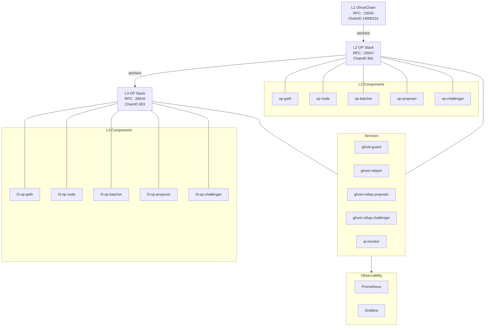

# Current Stack (L1/L2/L3)

Last updated: 2026-02-04

## Sources of Truth (files)
- `infra/opstack/.env`
- `infra/opstack/.env.l3`
- `services/stack.env`
- `infra/opstack/docker-compose.yml`
- `infra/opstack/docker-compose.l3.yml`
- `services/docker-compose.yml`
- `observability/infra/docker-compose.yml`

## Layer Summary

### L1 (GhostChain)
- Host RPC: `http://localhost:18545` (from `infra/opstack/.env` `HOST_L1_RPC`)
- Chain ID: `14000101` (from `infra/opstack/.env` `L1_CHAIN_ID`)
- Governance:
  - Governor: `0xdbC43Ba45381e02825b14322cDdd15eC4B3164E6`
  - Executor: `0x7bc06c482DEAd17c0e297aFbC32f6e63d3846650`
  (from `infra/opstack/.env` + `services/stack.env`)

### L2 (OP Stack anchored to L1)
- Host RPC: `http://localhost:29547` (from `infra/opstack/.env` `HOST_L2_RPC`)
- Chain ID: `901` (from `infra/opstack/.env` `L2_CHAIN_ID`)
- OP components (compose): `op-geth`, `op-node`, `op-batcher`, `op-proposer`, `op-challenger`
- Output oracle (L2->L1): `L2_OUTPUT_ORACLE_ADDRESS=0x1275D096B9DBf2347bD2a131Fb6BDaB0B4882487`
- L1 standard bridge: `0xC6bA8C3233eCF65B761049ef63466945c362EdD2`
- L1 cross-domain messenger: `0x59F2f1fCfE2474fD5F0b9BA1E73ca90b143Eb8d0`

### L3 (OP Stack anchored to L2)
- Host RPC: `http://localhost:39545` (from `infra/opstack/.env` `HOST_L3_RPC`)
- Chain ID: `903` (from `infra/opstack/.env` `OP_L3_CHAIN_ID`)
- Parent L2 RPC: `http://localhost:29547` (from `infra/opstack/.env.l3` `PARENT_L2_RPC`)
- L3 system config: `0x712516e61C8B383dF4A63CFe83d7701Bce54B03e`
- L3 portal: `0xbCF26943C0197d2eE0E5D05c716Be60cc2761508`
- L3 dispute game factory: `0x05Aa229Aec102f78CE0E852A812a388F076Aa555`
- L3 L2OO address: `0x1275D096B9DBf2347bD2a131Fb6BDaB0B4882487`

## AI / Governance Services
- AI monitor service: `services/ai-monitor`
  - L3 monitor health URL: `http://localhost:7577/health`
- Policy registry:
  - Address: `0x99bbA657f2BbC93c02D617f8bA121cB8Fc104Acf`
  - RPC: `http://localhost:18545`
  (from `services/stack.env` + `infra/opstack/.env.l3`)
- RunLog address: `0x3155755b79aA083bd953911C92705B7aA82a18F9`

## Compose Topology (primary)
- L2/L3 OP Stack: `infra/opstack/docker-compose.yml`, `infra/opstack/docker-compose.l3.yml`
- Services: `services/docker-compose.yml`
- Observability: `observability/infra/docker-compose.yml`

## Mermaid Overview (L1->L2->L3 + Ops)

