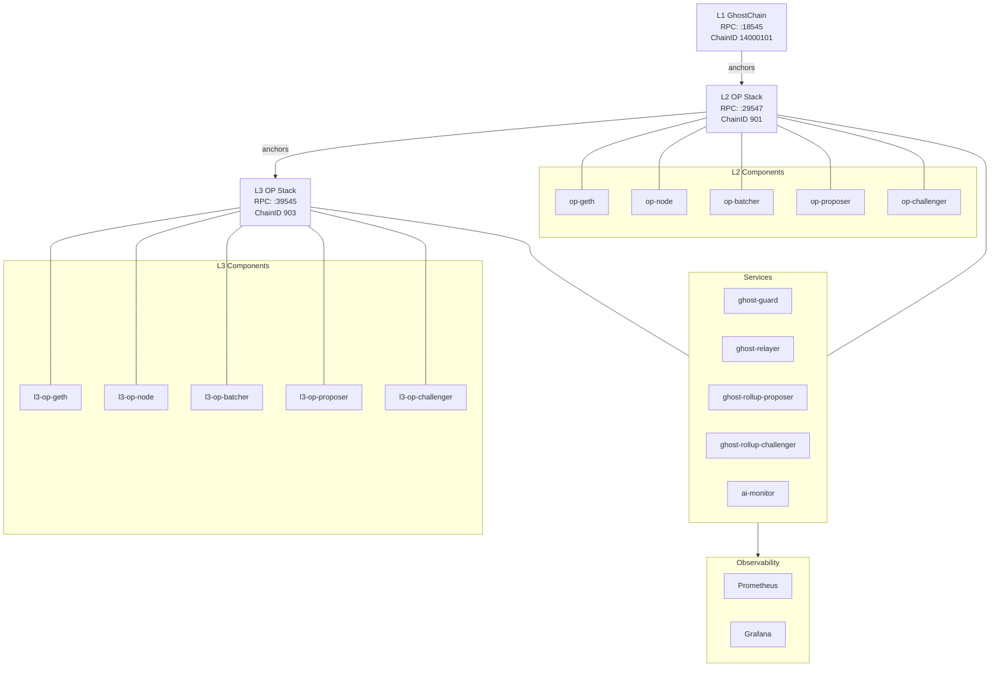

# Current Stack (L1/L2/L3)

Last updated: 2026-02-18

## Sources of Truth (files)
- `infra/opstack/.env`
- `infra/opstack/.env.l3`
- `services/stack.env`
- `infra/opstack/docker-compose.yml`
- `infra/opstack/docker-compose.l3.yml`
- `services/docker-compose.yml`
- `observability/infra/docker-compose.yml`

## Layer Summary

### L1 (GhostChain)
- Host RPC: `http://localhost:18545` (from `infra/opstack/.env` `HOST_L1_RPC`)
- Chain ID: `14000101` (from `infra/opstack/.env` `L1_CHAIN_ID`)
- Governance:
  - Governor: `0xdbC43Ba45381e02825b14322cDdd15eC4B3164E6`
  - Executor: `0x7bc06c482DEAd17c0e297aFbC32f6e63d3846650`
  (from `infra/opstack/.env` + `services/stack.env`)

### L2 (OP Stack anchored to L1)
- Host RPC: `http://localhost:29547` (from `infra/opstack/.env` `HOST_L2_RPC`)
- Chain ID: `901` (from `infra/opstack/.env` `L2_CHAIN_ID`)
- OP components (compose): `op-geth`, `op-node`, `op-batcher`, `op-proposer`, `op-challenger`
- Output oracle (L2->L1): `L2_OUTPUT_ORACLE_ADDRESS=0x2279B7A0a67DB372996a5FaB50D91eAA73d2eBe6`
- L1 standard bridge: `0xa513E6E4b8f2a923D98304ec87F64353C4D5C853`
- L1 cross-domain messenger: `0x0165878A594ca255338adfa4d48449f69242Eb8F`

### L3 (OP Stack anchored to L2)
- Host RPC: `http://localhost:39545` (from `infra/opstack/.env` `HOST_L3_RPC`)
- Chain ID: `903` (from `infra/opstack/.env` `OP_L3_CHAIN_ID`)
- Parent L2 RPC: `http://localhost:29547` (from `infra/opstack/.env.l3` `PARENT_L2_RPC`)
- L3 inbox: `0x8464135c8F25Da09e49BC8782676a84730C318bC`
- L3 token factory: `0x71C95911E9a5D330f4D621842EC243EE1343292e`
- L2->L3 rollup: `0x130A46b6E41DB6E1e18fb9c759F223c459190e90`
- L2->L3 bridge (services): `0xDadd1125B8Df98A66Abd5EB302C0d9Ca5A061dC2`
- Cascading finality oracles on L2:
  - `L1_FINALITY_ORACLE_ADDRESS=0x7B3Be2dDDdDf9A0a3fE1DC57B98980F662C3a422`
  - `L2_FINALITY_ORACLE_ADDRESS=0x650aEF4b63095e4EDe581BC79CdeA927e3ba553A`
  - `L3_FINALITY_ORACLE_ADDRESS=0x87F850cbC2cFfac086F20d0d7307E12d06fA2127`

## AI / Governance Services
- AI monitor service: `services/ai-monitor`
  - L3 monitor health URL: `http://localhost:7577/health`
- Policy registry:
  - Address: `0x99bbA657f2BbC93c02D617f8bA121cB8Fc104Acf`
  - RPC: `http://localhost:18545`
  (from `services/stack.env` + `infra/opstack/.env.l3`)
- RunLog address: `0x3155755b79aA083bd953911C92705B7aA82a18F9`

## Compose Topology (primary)
- L2/L3 OP Stack: `infra/opstack/docker-compose.yml`, `infra/opstack/docker-compose.l3.yml`
- Services: `services/docker-compose.yml`
- Observability: `observability/infra/docker-compose.yml`

## Mermaid Overview (L1->L2->L3 + Ops)

