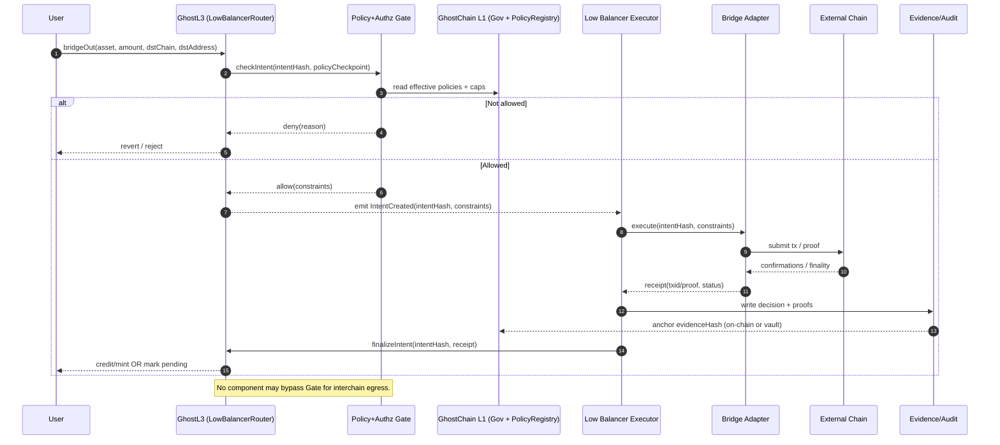

# Interchain Flow & Low Balancer (Phase 1)

This document defines the **Phase 1** target architecture for interchain operations:

- GhostChain **L1 → L2 → L3** settlement ladder (already present in this repo).
- A governed **Low Balancer** as the **only** interchain egress/ingress plane.
- **Non-bypassable authority**: no bridge, router, executor, or AI component may bypass Ghost governance.

## What exists today (in this repo)

- **Settlement ladder:** L3 settles to L2; L2 settles to L1 (`docs/ghostchain-architecture.md`, `docs/opstack-l2-l3-stack.md`).
- **Governance root:** L1 governance and a root `PolicyRegistry` contract (`contracts/src/governance/PolicyRegistry.sol`).
- **Policy gating primitive:** `PolicyGuard` (OFF/ADVISORY/ENFORCE, governance-bypass only via governance) (`contracts/src/ai/PolicyGuard.sol`).
- **Federated policy checkpoints:** L1 is the constitutional root; L2/L3 inherit upstream bounds (`docs/ai-core/federation.md`).
- **Bridge + liquidity services (ops UI):** `services/bridge-service`, `services/liquidity-service` (API surfaces + metrics), and `services/ghost-relayer` (L2↔L3 relaying).

## Low Balancer: what it is (Phase 1 definition)

**Low Balancer** is a governance-locked interchain liquidity and routing plane that:

1) Accepts **intents** originating on **L3** (e.g., “bridge asset X to chain Y”).
2) Evaluates intents through a **non-bypassable Policy+Authz Gate** rooted in **L1** policy + governance.
3) Routes allowed intents to **approved bridge adapters** for external EVM/Bitcoin/other ecosystems.
4) Emits **evidence** (decision inputs + receipts) and anchors hashes upstream for auditability.

Low Balancer is intentionally split into:

- **On-chain (L3):** intent escrow + accounting (the “Low Balancer Router” contract surface).
- **Off-chain (executor):** submits transactions/proofs to external chains, but is **power-limited** by on-chain gates and caps.

## Interchain flow (L1 → L3 → Low Balancer → external)

```mermaid
flowchart LR
  %% ============================================================
  %% Interchain Flow (Phase 1): L1 → L2 → L3 → Low Balancer → Out
  %%
  %% Key rule: NO bypass of Ghost governance authority.
  %% All interchain egress must pass through governed authorization + policy gates.
  %% ============================================================

  %% -----------------------
  %% Ghost settlement ladder
  %% -----------------------
  subgraph L1["GhostChain (L1) — constitutional root"]
    Gov["Governor + Timelock"]
    Policy["PolicyRegistry (root)"]
    Pause["PauseGuardian"]
    Authz["InterchainAuthorization"]
  end

  subgraph L2["GhostL2 (L2) — OP Stack anchored to L1"]
    L2Exec["op-geth + op-node"]
    L2Final["L2 finality window\n(outputs + disputes on L1)"]
  end

  subgraph L3["GhostL3 (L3) — OP Stack anchored to L2"]
    L3Exec["l3-geth + l3-op-node"]
    L3Final["L3 finality window\n(outputs + disputes on L2)"]
    LBRouter["Low Balancer Router (L3)\n(intent escrow + accounting)"]
  end

  %% -----------------------
  %% Low Balancer plane
  %% -----------------------
  subgraph LB["Low Balancer — interchain liquidity hub"]
    Gate["Policy + Authz Gate\n(non-bypassable)"]
    Liq["Liquidity Router\n(routes + caps)"]
    Bridge["Bridge Router\n(adapter registry)"]
    Exec["Executor / Relayer\n(offchain)"]
    Evidence["Evidence + Audit\n(hash anchored upstream)"]
  end

  %% -----------------------
  %% External ecosystems
  %% -----------------------
  subgraph EXT["External chains / ecosystems"]
    EVM_EXT["External EVM chain"]
    BTC["Bitcoin (UTXO)"]
    OTH["Others (EVM/non‑EVM)"]
  end

  %% Governance authority
  Gov --> Policy
  Gov --> Pause
  Gov --> Authz

  %% Policy / authz flow (federated checkpoints)
  Policy -. "policy checkpoints\n(L1→L2→L3)" .-> L2Exec
  Policy -. "policy checkpoints\n(L1→L2→L3)" .-> L3Exec
  Authz -. "allowlists + caps" .-> Gate
  Pause -. "emergency halt" .-> Gate

  %% Settlement ladder
  L1 -->|"anchors"| L2Exec
  L2Exec -->|"anchors"| L3Exec
  L2Final --- L2Exec
  L3Final --- L3Exec

  %% L3 → Low Balancer intents
  L3Exec -->|"user/app txs"| LBRouter
  LBRouter -->|"intent"| Gate
  Gate -->|"allowed"| Liq
  Liq --> Bridge
  Bridge --> Exec

  %% Egress to external chains
  Exec -->|"bridge / lock / mint"| EVM_EXT
  Exec -->|"custody / proofs"| BTC
  Exec -->|"adapter"| OTH

  %% Evidence anchoring
  Exec --> Evidence
  Evidence -. "evidenceHash" .-> Policy
```

Mermaid source: `docs/architecture/interchain-flow.mmd`

## Outbound transfer sequence (policy-gated)

Mermaid source: `docs/architecture/interchain-outbound-sequence.mmd`

## Non-bypassable governance rules (Phase 1)

These rules are architectural constraints that every later phase must preserve:

1) **Single constitutional root:** L1 governance + `PolicyRegistry` is the root of what interchain actions are permitted.
2) **Authority monotonicity:** L3 authority ⊆ L2 authority ⊆ L1 authority (lower layers cannot expand permissions).
3) **One egress plane:** external chain access is only via Low Balancer; no direct “L3→external” bridge paths exist.
4) **Governed adapters:** bridge adapters are allowlisted and revocable by governance (`InterchainAuthorization`).
5) **Emergency halt:** governance/guardians can halt interchain egress (planned: wire `PauseGuardian` into the gate).
6) **AI cannot override governance:** AI signals may inform gating (ADVISORY/ENFORCE) but cannot create permissions or bypass governance checks.

## Phase 1 deliverable boundaries

Phase 1 is **design + diagrams** only. Implementation work lands in later phases:

- Phase 2: AI Risk Engine + Policy gates behavior and failure modes.
- Phase 3: container/network separation (internal vs interchain) and least-privilege executor setup.
- Phase 4: on-chain `InterchainAuthorization` + `LowBalancerGovernor` and enforcement wiring (implemented; see `docs/architecture/phase4-governance.md`).

Next: `docs/architecture/interchain-policy-layer.md` (Phase 2).
