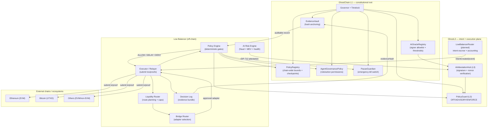
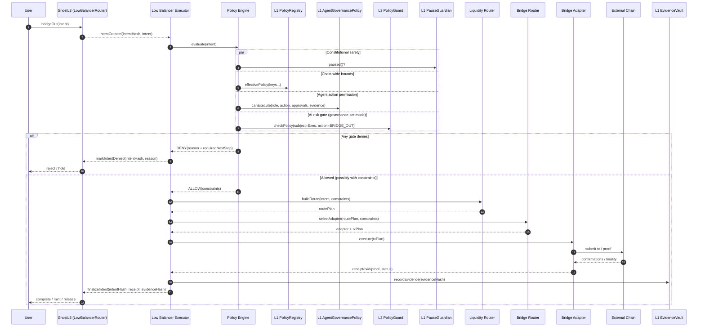

# Interchain AI & Policy Layer (Phase 2)

This document defines the **Phase 2** design for the interchain control plane that sits behind the Low Balancer:

- **AI Risk Engine** (fraud + MEV + infrastructure health) that produces signed attestations.
- **Policy Engine** that deterministically gates every interchain action.
- **Liquidity Router** and **Bridge Router** that plan routes only after policy allow.
- **Circuit breakers** that are governance-bounded and never override Ghost authority.

This is an extension of Phase 1 (`docs/architecture/interchain-flow.md`).

## Core principle (non-negotiable)

**AI does not grant permission. Governance grants permission.**

AI may *recommend* and *attest*; enforcement must be:

- **Deterministic** (repeatable from the same inputs).
- **Governance-controlled** (timelock, quorum, bounded policies).
- **Fail-closed** when required dependencies are missing.

Existing repo invariants apply, especially:
- AI cannot influence fork choice / ordering / finality (`docs/ai-core/invariants.md`, AI-INV-002).
- Governance bypass is governance-only (`contracts/src/ai/PolicyGuard.sol`, AI-INV-013).

## Components (Phase 2)

### 1) AI Risk Engine (off-chain)

**Job:** classify risk for **interchain intents** and **execution plans**, producing:

- `riskScoreBps` (0–10,000)
- `confidence` (0–255 or bps depending on attestation type)
- `reason codes` + `detailsHash` (hash of an explainable payload)
- `issuedAt` / `validUntil` TTL (short-lived)

**Inputs (minimum):**
- L3 intent stream (LowBalancerRouter events).
- L3/L2/L1 head + finality lag (reorg/lag risk).
- Bridge adapter health (success rate, latency, stuck queues).
- Liquidity observations (depth, price impact, quote dispersion).
- MEV monitor results (ordering anomalies, sandwich risk indicators).
- Compliance signals (denylist/jurisdictional constraints, when enabled).

**Outputs (two lanes):**
1) **On-chain attestations** (preferred): signed EIP-712 payloads posted to `AIAttestationHub` for the relevant layer.
2) **Evidence bundles** (always): JSON + hashes suitable for anchoring in `EvidenceVault`.

**Fraud detection behavior (examples of high-risk signals):**
- Replay / nonce anomalies, double-finalization patterns, or invariant violations.
- Large value outflows that exceed normal profile for subject/address cluster.
- Token metadata mismatch across layers (decimals/symbol/name changes).
- Sudden surge in intents to a new destination chain or adapter.
- Elevated reorg risk (head oscillation) on any required parent layer.

**MEV risk behavior (examples of high-risk signals):**
- Route has high predicted price impact vs depth; wide quote dispersion across venues.
- Mempool congestion + predictable swap path (sandwichable).
- Lack of private execution path for large swaps/bridges.
- Sequencer ordering anomaly signals exceed threshold.

### 2) Policy Engine (deterministic, off-chain)

**Job:** produce an **ALLOW / DELAY / DENY** decision for a candidate action:

- `bridgeOut` (egress)
- `finalizeIn` (ingress finalization)
- `pause/throttle` (circuit breaker actuation)
- `adapter enable/disable` (routing changes)

**Policy Engine MUST:**
- Read **chain-wide bounds** from `PolicyRegistry` (L1 constitutional root).
- Read **agent action permissions** from `AgentGovernancePolicy` (role/action tiering, approvals, evidence requirements).
- Read **AI enforcement mode** via `PolicyGuard` (OFF/ADVISORY/ENFORCE), where mode is governance-set.
- Respect `PauseGuardian` (global kill switch / emergency halt).
- Fail closed if required registries are missing/unreachable.

### 3) Liquidity Router (off-chain)

**Job:** given an allowed intent + constraints, return a route plan:

- split/aggregate amounts across venues (if permitted)
- choose slippage bounds and timeouts
- choose execution style (public vs private)
- choose “wait for finality” thresholds before next hop

**Constraints it must obey:**
- Per-tx and per-window caps (PolicyRegistry / InterchainAuthorization).
- MEV constraints (max MEV risk, mandatory private submission for size).
- Only approved assets and venues.
- No route may cause the system to exceed egress caps when combined.

### 4) Bridge Router (off-chain)

**Job:** map `(dstChain, asset, routePlan)` → **approved adapter + txPlan**.

**Rules:**
- Adapter registry is **governance-managed** (allowlist + revocation).
- Each adapter declares:
  - supported chain(s) and assets
  - required finality rules (confirmations / dispute windows / challenge periods)
  - receipt schema for evidence anchoring
- Bridge Router must refuse adapters that cannot meet policy requirements.

### 5) Circuit Breakers (policy-gated)

Circuit breakers are actions like:
- **THROTTLE** (increase delay / lower cap)
- **HOLD** (require more finality or manual approval)
- **PAUSE** (halt egress/ingress finalization)
- **DISABLE_ADAPTER** (stop using a failing adapter)

**Governance non-override rule:** even “automatic” circuit breakers are only permitted if:

1) governance has enabled the relevant role/action in `AgentGovernancePolicy`, and
2) required approvals/evidence are present, and
3) `PolicyGuard` is not in a state that blocks the action (ENFORCE gate), and
4) `PauseGuardian` is not paused (or the action is “pause” itself and explicitly permitted).

If any requirement is missing, AI must only **recommend** the breaker and open an escalation ticket/proposal.

## Mapping to this repo (what exists today)

Phase 2 is a design spec, but the repo already contains building blocks that map cleanly:

- **Risk signals + actuation (infra):** `services/ai-monitor` (risk scoring from RPC/OP metrics + policy-gated delay/pause).
- **Fraud/compliance attestations:** `services/ghost-guard` (builds operation IDs, signs/relays attestations to on-chain guardians).
- **Governance-anchored policy proposals:** `services/ghost-gas-engine` + `contracts/src/governance/AIProposalExecutor.sol` (evidence + timelock/quorum path).
- **Operator surfaces (to evolve into routers):** `services/liquidity-service`, `services/bridge-service` (status/metrics endpoints today).
- **On-chain primitives:** `contracts/src/governance/PolicyRegistry.sol`, `contracts/src/ai/AgentGovernancePolicy.sol`, `contracts/src/ai/AIOracleRegistry.sol`, `contracts/src/ai/AIAttestationHub.sol`, `contracts/src/ai/PolicyGuard.sol`.

## Policy gates for interchain access

For any **interchain egress** (L3 → external), the Policy Engine evaluates the following gates in order:

1) **Emergency halt gate:** `PauseGuardian.paused() == false` (or deny).
2) **Federation gate:** upstream policy registry reachable when required (L3 ⊆ L2 ⊆ L1).
3) **Destination allowlist gate:** destination chain is allowed (`contracts/src/governance/InterchainAuthorization.sol`).
4) **Adapter allowlist gate:** adapter is allowed + not revoked.
5) **Caps gate:** per-tx, per-window, per-chain, per-asset caps.
6) **Finality gate:** required parent-layer dispute windows are satisfied (L3→L2 and L2→L1), plus external confirmations.
7) **AI risk gate:** `PolicyGuard.checkPolicy(subject, action)` passes (ENFORCE blocks, ADVISORY logs).
8) **Evidence gate:** if action tier requires evidence, evidence hash must be present and anchorable.
9) **Agent permission gate:** `AgentGovernancePolicy.canExecute(role, action, approvals, hasEvidence)` must be true.

**Fail-closed rule:** if any required dependency cannot be read (RPC down, contract missing, stale attestation in ENFORCE),
the decision is **DENY** (or **DELAY** if explicitly allowed by policy).

## Suggested on-chain keys (Phase 2 naming)

These names are used to derive `bytes32` keys (e.g., `keccak256(toUtf8Bytes(name))`) and are meant to be stable across services:

### AgentGovernancePolicy
- Role: `LOW_BALANCER_EXECUTOR`
- Actions (examples):
  - `INTERCHAIN_BRIDGE_OUT`
  - `INTERCHAIN_FINALIZE_IN`
  - `INTERCHAIN_THROTTLE_EGRESS`
  - `INTERCHAIN_PAUSE_EGRESS`
  - `INTERCHAIN_DISABLE_ADAPTER`

### PolicyGuard actions
- `ghostai.action.interchain.bridge_out`
- `ghostai.action.interchain.finalize_in`
- `ghostai.action.interchain.pause`
- `ghostai.action.interchain.throttle`

### PolicyRegistry (chain-wide bounds)
Use bounded numeric values + activation delays for anything that must never change instantly:
- `ghost.policy.interchain.enabled` (0/1)
- `ghost.policy.interchain.egress.cap.per_tx` (notional or token units)
- `ghost.policy.interchain.egress.cap.per_day`
- `ghost.policy.interchain.finality.min_parent_seconds`
- `ghost.policy.interchain.mev.max_risk_bps`
- `ghost.policy.interchain.fraud.max_risk_bps`

Per-chain/per-asset values can be expressed via hashed composite keys in Phase 4 (e.g., `keccak256("...cap.chain", chainId)`).

## Diagrams

### Component data flow (risk → policy → routing → execution)

Mermaid source: `docs/architecture/interchain-policy-layer.mmd`

### Policy gating sequence (outbound)

Mermaid source: `docs/architecture/interchain-policy-gates-sequence.mmd`

## Phase 2 deliverables (what’s “done”)

Phase 2 is complete when:

- The component responsibilities and gate ordering above are accepted as canonical.
- Low Balancer interchain access is explicitly defined as **policy-gated** and **governance-non-bypassable**.
- The policy key namespace and action IDs are locked enough to implement Phase 3/4 without renaming churn.
