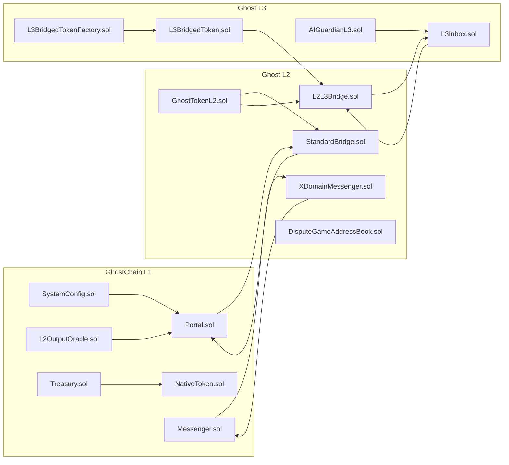

# GhostChain Contract Interactions (L1/L2/L3)

Notes:
- Diagram reflects custom contracts under `contracts/src` and focuses on L1/L2/L3 messaging, bridge, and token flows.
- OP Stack upstream contracts are not duplicated here.
