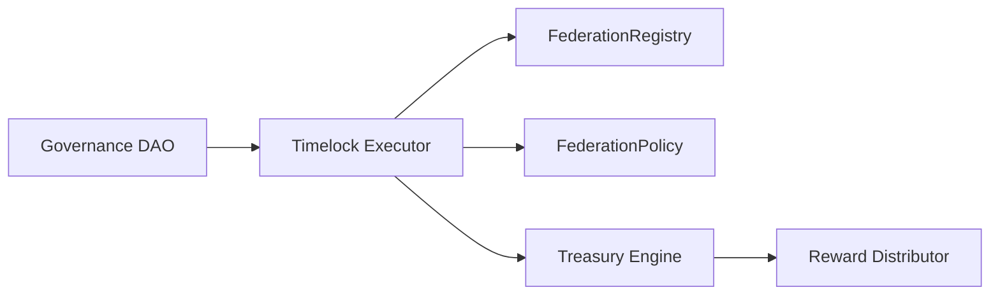
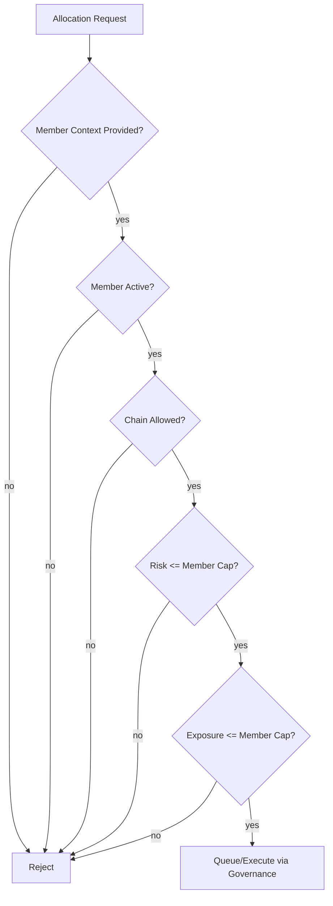
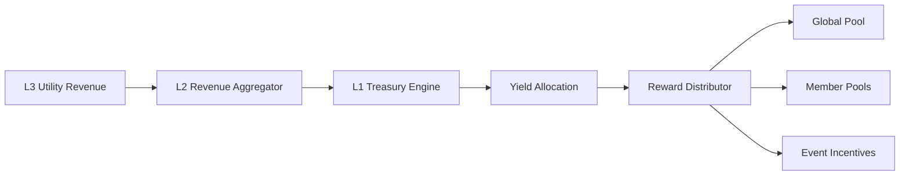

# Federation Sovereign Model

## Overview

Federation extends the sovereign treasury model with member-level policy constraints while preserving constitutional routing:

- L3 -> L2 -> L1 only
- Treasury capital deployment remains L1-governed
- Federation members receive policy-bound distributions only
- No direct member withdrawals from root treasury

## Governance Diagram

## Policy Gating Diagram

## Revenue Distribution Diagram

## Runtime Controls

- `services/treasury-engine` enforces federation policy file checks at allocation time.
- `services/reward-distributor` rejects non-compliant member pools in reward cycles.
- Prometheus exposes:
  - `federation_members_active`
  - `treasury_exposure_by_member`
  - `policy_violations_total`
