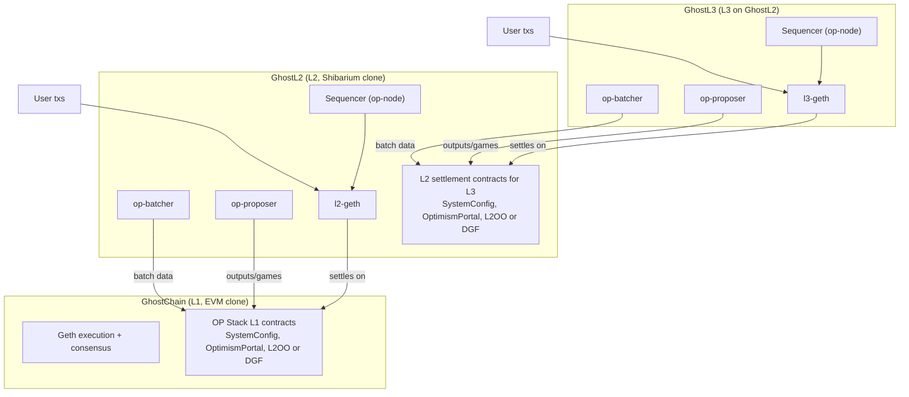

# GhostChain Architecture (L1/L2/L3)

GhostChain is an EVM-compatible L1. GhostL2 is a Shibarium-style OP Stack L2 that settles to GhostChain. GhostL3 is an OP Stack L3 that settles to GhostL2.

## Layers

### GhostChain (L1, EVM clone)
- Geth PoA devnet (chainId `14000101`) and final settlement layer.
- Hosts OP Stack L1 contracts for GhostL2 (SystemConfig, OptimismPortal, bridges, L2OutputOracle or DisputeGameFactory).
- Native gas asset is GST (ERC‑20) on L1.

### GhostL2 (L2, Shibarium clone)
- OP Stack rollup on GhostChain (sequencer in `op-node`, execution in `l2-geth`).
- Batcher posts L2 data to GhostChain; proposer posts outputs or dispute games to GhostChain.
- Also hosts the settlement contracts for GhostL3.
- Optional ERC20 gas token configured via `SystemConfig` (deployed on GhostChain).

### GhostL3 (L3 on GhostL2)
- OP Stack L3 (separate `op-node` + `l3-geth`).
- Batcher posts L3 data to GhostL2; proposer posts outputs or dispute games to GhostL2.
- Optional ERC20 gas token configured via `SystemConfig` (deployed on GhostL2).

Canonical gas token (L1 ERC‑20):
- Contract: `0x5FbDB2315678afecb367f032d93F642f64180aa3`
- Symbol: `GST`
- Genesis mint: `1,000,000,000` GST to `0xf39fd6e51aad88f6f4ce6ab8827279cfffb92266`
- L2/L3 gas token source: L1 ERC‑20 address above

## Sequencers and tx pools
- Each layer has its own sequencer and txpool; they do not share state.

## Settlement flow
- L3 batches settle to GhostL2.
- L2 batches settle to GhostChain.
- Outputs/dispute games are posted at each hop.

## Config pointers
- L2 rollup config: `infra/opstack/config/rollup.json`
- L3 rollup config: `infra/opstack/l3/ghostl3/config/rollup.json`

## Diagram

Mermaid source: `docs/ghostchain-architecture.mmd`
