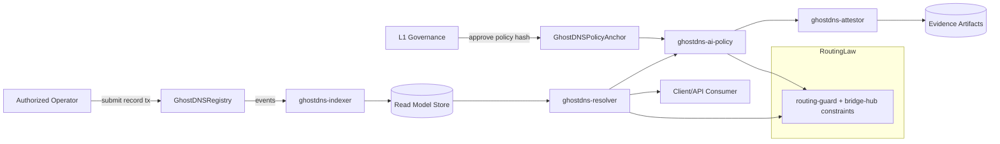
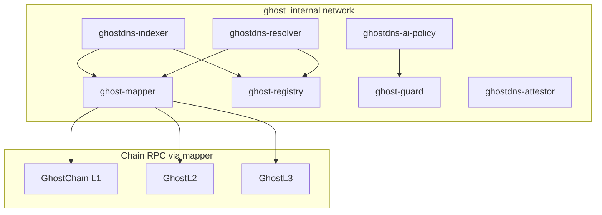
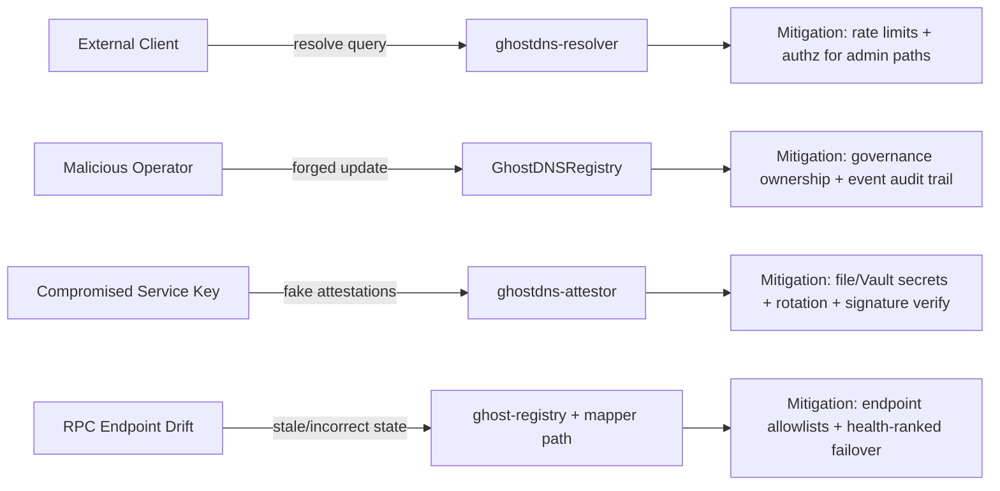

# GhostDNS AI Architecture (Phase 2)

Date: 2026-02-24

## 1) Goals

- Provide governance-controlled DNS-style naming and resolution for GhostChain ecosystems.
- Keep strict chain policy: no direct `L3 -> L1`, and no external egress from `L2/L3`.
- Preserve current hardening defaults (non-root, read-only FS, least privilege).
- Produce deterministic, auditable AI policy decisions with evidence artifacts.

## 2) Non-Goals

- Replacing L1/L2/L3 consensus clients or altering OP/geth internals.
- Introducing unrestricted autonomous execution in production.
- Creating a second, conflicting routing-policy implementation.

## 3) Proposed Component Topology

### A. On-chain

1. `GhostDNSRegistry` (governance-owned)
   - Stores canonical domain records and versioned updates.
   - Emits append-only events for indexers/evidence.

2. `GhostDNSPolicyAnchor` (optional split contract)
   - Anchors approved policy hash/version and signer sets.
   - Enables deterministic off-chain policy engine attestation checks.

### B. Off-chain Services

1. `ghostdns-indexer`
   - Subscribes to GhostDNS contract events.
   - Materializes read models for fast lookup and history queries.
   - Tracks finality boundaries by layer.

2. `ghostdns-resolver`
   - Exposes read APIs (`/resolve`, `/reverse`, `/history`, `/health`, `/metrics`).
   - Enforces layer/egress checks via shared routing guard semantics.
   - Serves only validated/finalized records by policy.

3. `ghostdns-ai-policy`
   - Deterministic policy evaluator (no direct state mutation).
   - Produces signed decision artifacts and confidence metadata.
   - Fail-closed in production unless governance explicitly allows fail-open mode.

4. `ghostdns-attestor` (can be integrated with existing attestor patterns)
   - Packages policy decision + context + hash references.
   - Anchors attestations and writes compliance evidence files.

### C. Shared Packages

1. `packages/ghostdns-policy`
   - Pure functions for policy checks, scoring, and deterministic decision outputs.

2. `packages/ghostdns-types`
   - Shared schemas (record, attestation, evidence envelope).

## 4) Data Flow Diagram

## 5) Service Topology Diagram

## 6) Threat Model Diagram

## 7) Policy and Safety Controls

- Reuse `packages/routing-guard` semantics in resolver/policy modules.
- Require finalized ancestry checks before high-trust resolution responses.
- Gate all write/mutation flows by governance role and signed approvals.
- Default AI execution mode to advisory/audit in prod, with explicit enable flags for execution.
- Emit immutable evidence bundles for each policy-impacting action.

## 8) Container + Runtime Requirements

- Non-root user (`1000:1000`), `cap_drop: [ALL]`, `no-new-privileges:true`.
- `read_only: true` with explicit write mounts for state/evidence only.
- Health probes for `/health` and metrics endpoint for `/metrics`.
- Secrets sourced from files (`*_FILE`) and Vault integration paths where available.

## 9) Phased Implementation Plan

### Phase A — MVP (read path first)
- Implement `ghostdns-indexer` + `ghostdns-resolver` read-only path.
- Add metrics, tracing, evidence logging (read events only).
- No autonomous write actions.

### Phase B — Policy + attestation
- Implement `ghostdns-ai-policy` deterministic evaluator.
- Add attestation output and policy hash anchoring checks.
- Introduce governance-reviewed policy rollout process.

### Phase C — Controlled write automation
- Add optional assisted update workflows with strict guardrails.
- Require multi-approval / governance flags for production mutation.
- Add rollback playbooks and chaos tests for resolver/indexer failure modes.

### Phase D — Production hardening and compliance
- Full threat-model verification, load tests, and failover drills.
- Evidence-pack generation integrated into CI/release gates.
- Final readiness checklist + operator runbook.

## 10) Acceptance Criteria (Architecture Phase)

- Architecture is fully additive and compatible with existing compose/routing/governance conventions.
- Every write-capable pathway has governance + policy + evidence controls.
- Resolver behavior remains deterministic and auditable under degraded RPC conditions.
- No path enables forbidden transitions (`L3 -> L1`) or forbidden external egress from `L2/L3`.
