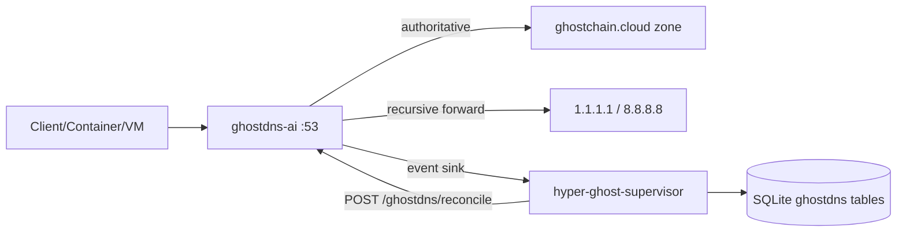
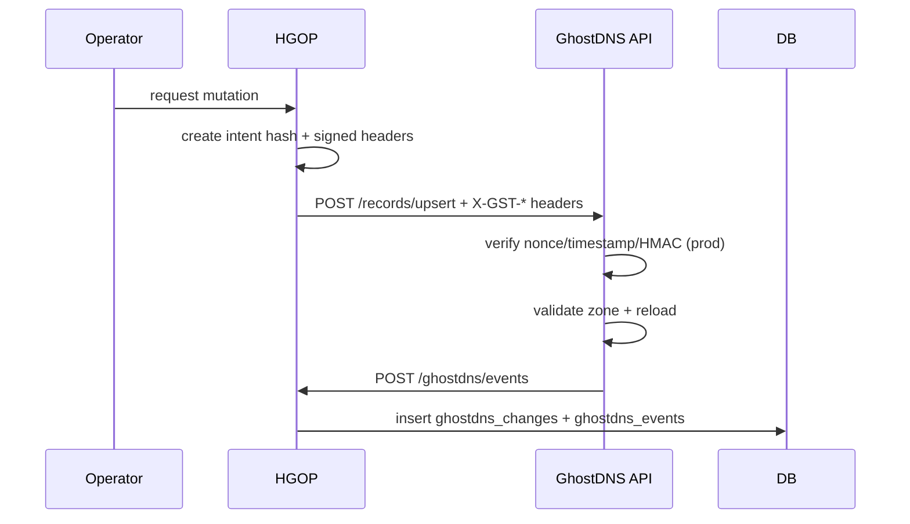
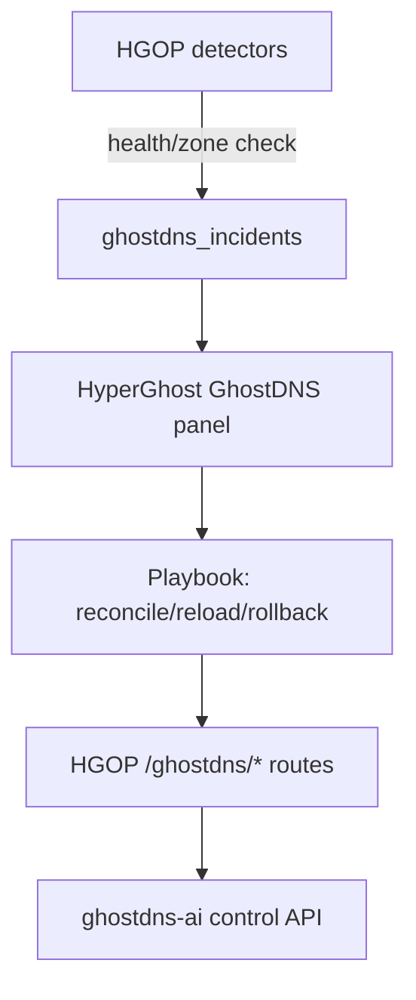

# GhostDNS AI Microservice + HGOP Integration

## Request flow

## Governance approval flow

## Incident flow

## Safe rollout checklist

1. Build and start GhostDNS microservice profile:
   - `docker compose --env-file services/stack.env -f docker-compose.autonomy.yml --profile ghostdns up -d ghostdns-ai`
2. Validate control plane:
   - `curl -fsS http://127.0.0.1:18089/health`
3. Validate DNS service:
   - `dig +short l1.ghostchain.cloud @127.0.0.1`
4. Wire HGOP env:
   - `HG_GHOSTDNS_URL=http://host.docker.internal:18089`
   - `HG_GHOSTDNS_SHARED_SECRET=<shared-secret>`
5. Use dashboard:
   - `/ai/hyperghost/ghostdns`

## Client DNS setup

- Client primary DNS: hypervisor IP (`192.168.122.205`)
- Client secondary DNS: `1.1.1.1`

## Mode switching

- Dev mode: `POST /set-mode {"mode":"dev"}`
- Test mode: `POST /set-mode {"mode":"test"}`
- Prod mode: `POST /set-mode {"mode":"prod"}` (mutations require signed approval headers)
