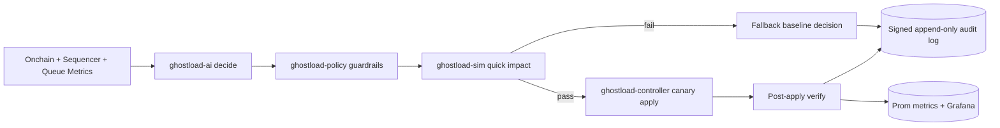
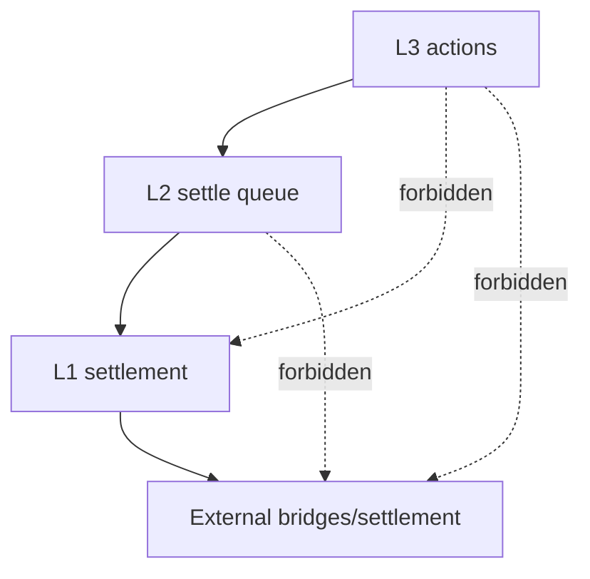

# GhostLoad AI Architecture

## Navigation
- Baseline: [BASELINE.md](./BASELINE.md)
- Rollout: [ROLLOUT.md](./ROLLOUT.md)
- Governance Proposal: [GOVERNANCE_PROPOSAL.md](./GOVERNANCE_PROPOSAL.md)
- Readiness Summary: [../../artifacts/ghostload/READINESS_SUMMARY.md](../../artifacts/ghostload/READINESS_SUMMARY.md)

## Scope
GhostLoad AI is an autonomous-but-bounded control plane for GhostChain L1, GhostL2, and GhostL3. It optimizes fee stability, profitability, and energy efficiency while enforcing the non-negotiable routing law:

- L3 transacts only with L2
- L2 transacts only with L1
- external settlement/bridging only via L1

## Existing knobs discovered (Phase 0)
- OP Stack/env controls: `infra/opstack/.env.example` (`BASE_FEE_GWEI`, `FEE_MARKET_*`, `BLOCK_GAS_LIMIT`, `SEQUENCER_L1_CONFS`)
- OP services and gate controls: `infra/opstack/docker-compose.yml` (`op-gate`, `ghost-gas-engine`, proposer/batcher related env)
- Runtime production doctor/gates: `infra/scripts/doctor-l2.sh`, `infra/scripts/doctor-l3.sh`, `infra/scripts/production/configure-build-ready.sh`
- Existing gas/AI economics service: `services/ghost-gas-engine`
- Existing routing and bridge surfaces: `services/bridge-service`, `services/ghost-relayer`, `services/ghost-rpc-proxy`

## GhostLoad components
1. `services/ghostload-ai` — bounded decision engine (`/decide`, `/explain`, `/health`, `/metrics`)
2. `packages/ghostload-policy` — policy-as-code, constraints, invariants, routing-law checks
3. `services/ghostload-controller` — actuator with `plan -> validate -> canary -> apply -> verify`
4. `tools/ghostload-sim` — replay/stress simulation with acceptance thresholds
5. Observability assets:
   - `infra/grafana/dashboards/ghostload.json`
   - `infra/prometheus/alerts/ghostload.yml`

## Control loop

## Routing law enforcement

## Safety model
- Hard policy bounds: fee bands, per-epoch delta caps, cooldown windows, liveness floor
- Critical parameters require manual actor path (governance workflow)
- Kill switch: `GHOSTLOAD_KILL_SWITCH=1`
- Manual override lock: `GHOSTLOAD_MANUAL_ONLY=1`
- AI never applies direct L3->L1 or L2->external routes

## Actuator mapping
- L3 intake shaping: throughput caps (`throughput.minRps/maxRps`) + anti-spam mode in decision output
- L3->L2 batch tuning: bounded fee action by layer
- L2 queue/settlement pacing: bounded fee actions and cooldowns
- L1 settlement safety: external settlement layer fixed to L1

## Governance lock classes
- Critical (manual/governance path): routing edges, external settlement layer, hard max fee ceilings, profit floor
- Bounded autonomous (inside policy): target-band fee nudges, non-critical throughput tuning, cooldown-compliant updates
