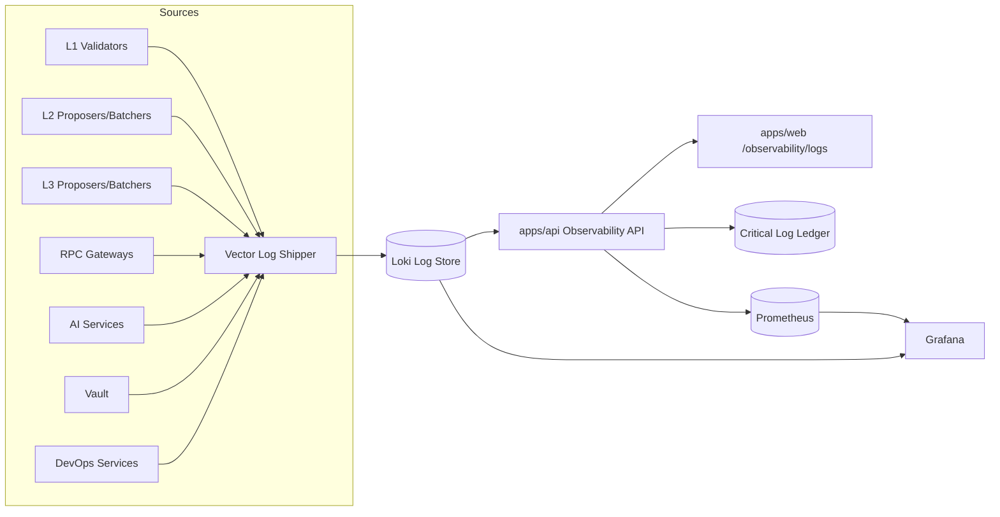

# Architecture

Data flow:
1. Vector collects Docker logs and tags them with component, layer, chain, and level.
2. Loki stores raw logs for search and streaming.
3. apps/api normalizes logs, redacts secrets, classifies severity, and exposes advanced APIs.
4. Critical logs are written to an append-only ledger with hash chaining.
5. Prometheus scrapes log-derived metrics from apps/api and feeds Grafana dashboards.
