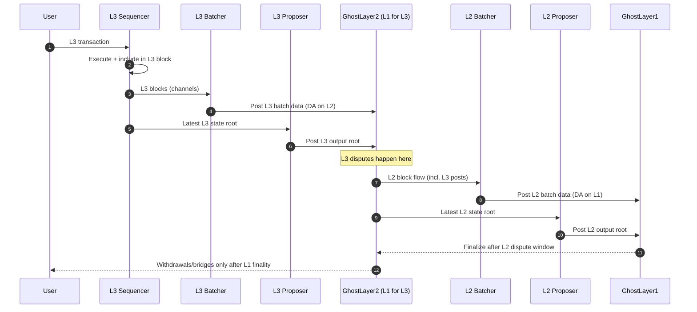

# GhostLayer3 → GhostLayer2 → GhostLayer1 (OP Stack)

OP Stack layering for the Ghost settlement ladder where GhostLayer3 (L3) settles to GhostLayer2 (L2), and L2 settles to GhostLayer1 (L1). Covers the transaction path, where data/roots land, and how to run the combined devnet.

## Layering model
- L2 (GhostLayer2) posts batches + outputs to L1 via the OP portal + dispute system.
- L3 (GhostLayer3) treats L2 as its L1: batches + outputs land on L2 and can be disputed there.
- Finality flows upward: L3 → L2 challenge window, then L2 → L1 challenge window, then multichain/bridges unlock.

## L3 → L2 → L1 flow (OP Stack semantics)


### Fee knobs by layer (keep L3 cheap, keep L1 profitable)
- L3: high gas limit, low block time, low basefee targets, aggressive batching to L2.
- L2: charges L3 via gas used for L3 batch + output posts; reserve a slice of L3 fees to fund posting.
- L1: moderate fees; validators earn from settlement posts, not every user tx.

## Docker compose layout (two OP stacks: L2 + L3)
Use the existing devnet compose files and layer them to run both stacks.

### Bring up L1+L2 (base)
```bash
bash infra/scripts/opstack/build.sh                    # one-time image build
cp infra/opstack/.env.sample infra/opstack/.env
cp infra/opstack/.env.secrets.sample infra/opstack/.env.secrets
bash infra/scripts/opstack/keys/init.sh
docker compose --env-file infra/opstack/.env --env-file infra/opstack/.env.secrets \
  -f infra/opstack/docker-compose.yml up -d l1 op-gate l2-geth op-node op-batcher op-proposer
```

### Add L3 on top of L2
```bash
docker compose --env-file infra/opstack/.env --env-file infra/opstack/.env.secrets \
  -f infra/opstack/docker-compose.yml \
  -f infra/opstack/docker-compose.l3.yml \
  up -d l3-geth l3-op-node l3-op-batcher l3-op-proposer
```

Key defaults:
- L3 batcher posts to L2 (`L3_L1_RPC=http://l2-geth:8545`).
- L3 proposer posts output roots to L2 (`L3_GAME_FACTORY_ADDRESS` points at L2 dispute game factory).
- L2 batcher/proposer post to L1 (Anvil) via `op-gate` for Guard-aware control.

### Optional: challengers for both layers
- Overlay `infra/opstack/docker-compose.challengers.yml` to run challengers per layer:
```bash
docker compose --env-file infra/opstack/.env --env-file infra/opstack/.env.secrets \
  -f infra/opstack/docker-compose.yml \
  -f infra/opstack/docker-compose.l3.yml \
  -f infra/opstack/docker-compose.challengers.yml \
  up -d op-challenger l3-op-challenger
```
- Fill `L2_GAME_FACTORY_ADDRESS`, `L3_GAME_FACTORY_ADDRESS`, `CHALLENGER_KEY`; Cannon/Kona bins + prestates default to the vendored optimism assets mounted at `/assets`, but override with your own paths if you prefer.

### Finality + multichain guardrails
- Allow L3→L2 withdrawals only after L3’s dispute window on L2 closes.
- Allow L2→L1 withdrawals/exports only after L2’s dispute window on L1 closes.
- Multichain bridges read finalized state (post L1 finality) to avoid reorg risk.
