# GhostL-Stack Repository Diagram

```mermaid
flowchart TB
    root[/ghostl-stack/]

    root --> apps[apps/]
    root --> services[services/]
    root --> contracts[contracts/]
    root --> infra[infra/]
    root --> packages[packages/]
    root --> docs[docs/]
    root --> chains[chains/]
    root --> observability[observability/]
    root --> ops[ops/]
    root --> core[core-service/]
    root --> artifacts[artifacts/]
    root --> scripts[scripts/]
    root --> dist[dist/]
    root --> node_modules[node_modules/]

    apps --> apps_api[api/]
    apps --> apps_web[web/]
    apps --> apps_worker[worker/]

    chains --> l2[l2/]
    chains --> l3[l3/]

    infra --> infra_opstack[opstack/]
    infra --> infra_docker[docker/]
    infra --> infra_scripts[scripts/]
    infra --> infra_observability[observability/]
    infra --> infra_k8s[k8s/]
    infra --> infra_helm[helm/]
    infra --> infra_terraform[terraform/]

    observability --> obs_ai[ai/]
    observability --> obs_alerts[alerts/]
    observability --> obs_api[api/]
    observability --> obs_collector[collector/]
    observability --> obs_storage[storage/]
    observability --> obs_ui[ui/]

    ops --> ops_diagrams[diagrams/]
    ops --> ops_docker[docker/]
    ops --> ops_k8s[k8s/]
    ops --> ops_scripts[scripts/]

    contracts --> contracts_src[src/]
    contracts --> contracts_test[test/]
    contracts --> contracts_reports[reports/]

    contracts_src --> contracts_governance[src/governance/]
    contracts_test --> contracts_invariants[test/invariants/]

    docs --> docs_ai[ai-core/]
    docs --> docs_security[security/]
    docs --> docs_ops[ops/]
    docs --> docs_chain[ghostchain/]

    classDef primary fill:#0b1a2b,stroke:#2a4f7a,color:#e7f1ff;
    classDef secondary fill:#14273f,stroke:#2a4f7a,color:#e7f1ff;
    class root primary;
    class apps,services,contracts,infra,packages,docs,chains,observability,ops,core,artifacts,scripts,dist secondary;
```

Notes:
- This diagram focuses on top-level structure and key subdirectories commonly used in the repo.
- `node_modules/` is generated by package installs and can be omitted if you want a source-only view.
- If you want a more detailed or service-specific view, tell me which area to expand.
