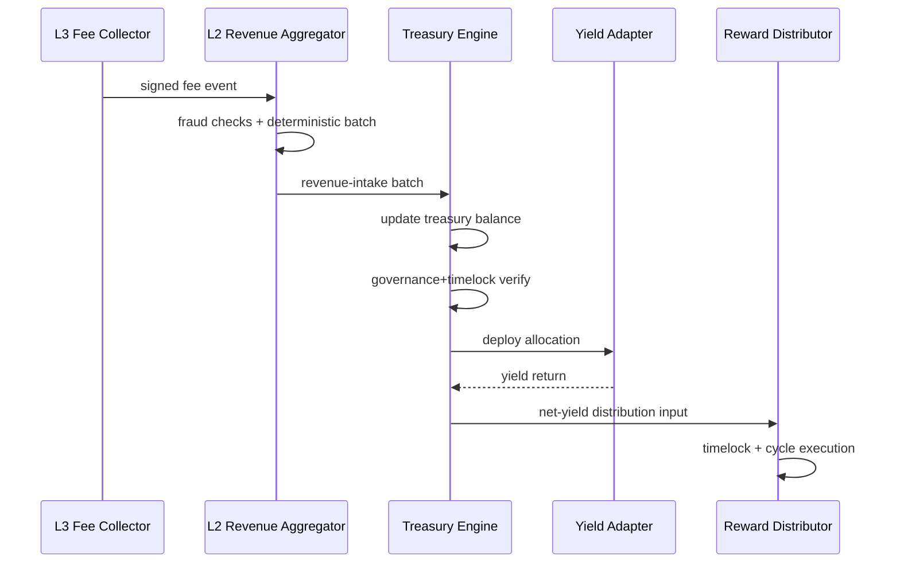
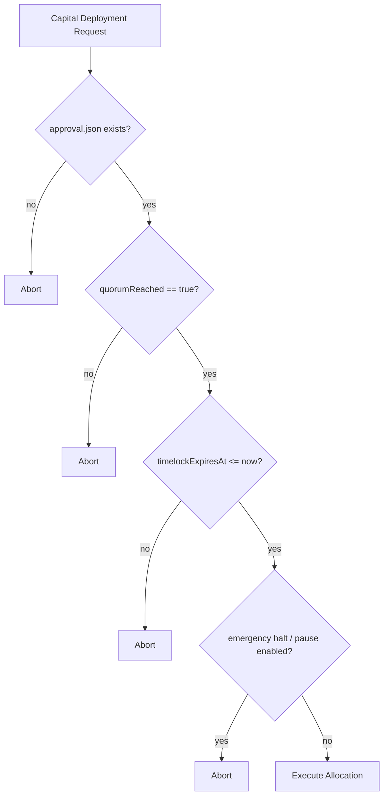

# Sovereign Engine Certification

## Architecture Diagram

```mermaid
flowchart LR
  L3[L3 Utility Revenue]\nGas + Deploy + SDK + Commission --> L3C[l3-fee-collector]
  L3C -->|L3->L2 only| L2A[l2-revenue-aggregator]
  L2A -->|L2->L1 only| L1T[treasury-engine (L1)]
  L1T --> YR[Yield Router / Adapters]
  YR -->|Yield Return| L1T
  L1T --> RD[reward-distributor]
  RD --> L2I[L2 Incentive Pool]
  RD --> L3I[L3 Event Incentives]
```

## Treasury Flow Diagram



## Governance Enforcement Diagram



## Deployment Checklist

- [ ] `bash scripts/verify-routing.sh`
- [ ] `bash scripts/verify-governance.sh --proposal-id <id>`
- [ ] `docker compose -f docker-compose.sovereign.yml config`
- [ ] `docker compose -f docker-compose.sovereign.yml up -d --build`
- [ ] `bash scripts/smoke/sovereign-economy.sh`
- [ ] `curl -fsS http://localhost:7683/v1/treasury/proof`

## Production Readiness Checklist

- [ ] Routing-law hard checks enabled at ingress and batching stages
- [ ] Governance lock validates quorum + timelock for execution paths
- [ ] Emergency halt + pause controls tested
- [ ] Metrics scraped in Prometheus for all four services
- [ ] Alert rules loaded and firing tested
- [ ] SQLite ledgers backed up and recovery procedure validated
- [ ] Contract tests pass (`npm --prefix contracts run test:sovereign`)

## Risk Disclosure Summary

- External yield adapters are pluggable and may fail or underperform.
- SQLite storage is single-node; multi-region HA requires replication strategy.
- Numeric precision in service-level metrics is approximate (Prometheus float conversion).
- Governance file-based gate is strong for deploy pipelines but must be paired with on-chain validation in production governors.
